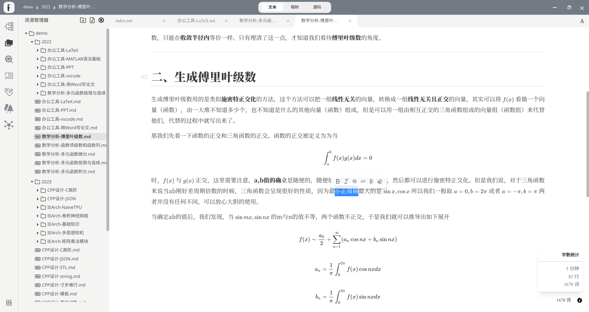
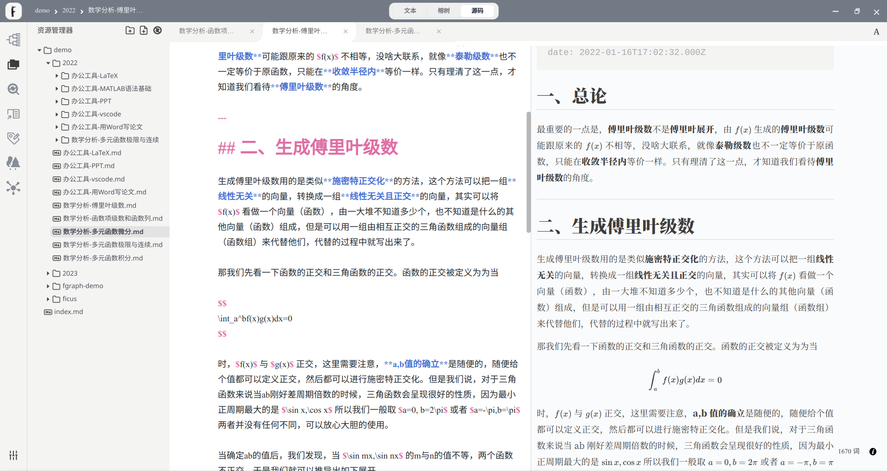
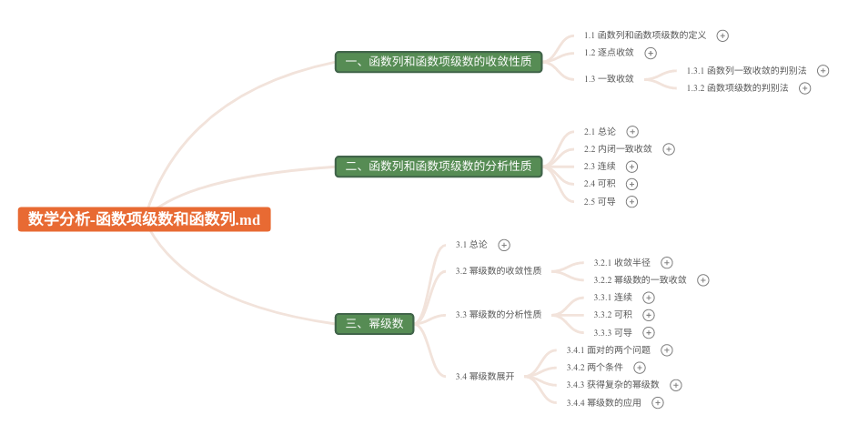
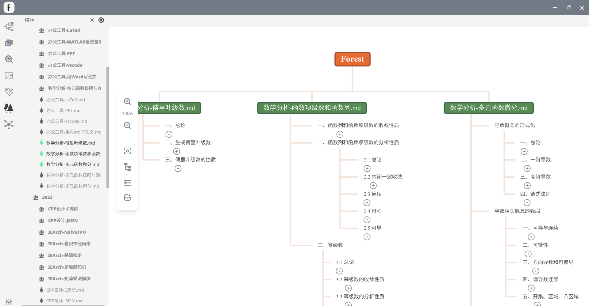
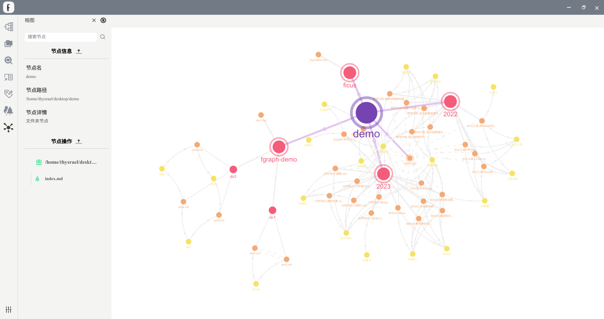
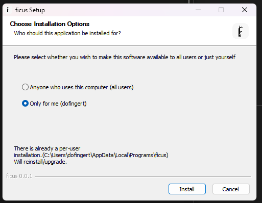

<p align = "center">

<br><br>


<br><br>
</p>


<h1 align="center">Ficus</h1>

README: [汉语](./README-zh.md) | [English](./README.md)

$\tt{Ficus}$ 是一款 `markdown` 文档的编辑管理软件，由 $\tt{gg=G}$ 团队开发。

$\tt{Ficus}$ 释义为“榕树”，榕树具有“冠盖如伞、一木成林“的特点。这也恰是本款软件想要为用户提供的核心服务：让用户的 md 文档可以像一棵榕树一样被浏览和编辑，同时让用户的多个 md 文档像榕树林一样进行多种形式的关联。我们希望用户的体验如这款软件的标语一样：

<p align = "center">

</p>

$\tt{Ficus}$ 基于 `Vue3, Electron` 框架开发，提供 Windows、macOS 和 Linux 系统的安装包。

详细信息可以在[ficus官网](https://ficus.world/)进一步了解。


## 先览

**富文本模式**

<p align = "center">

</p>

**源码模式**

<p align = "center">

</p>

**榕树模式**

<p align = "center">

</p>

**榕林模式**

<p align = "center">

</p>

**榕图模式**

<p align = "center">

</p>


## 构建

可以在[下载链接](https://ficus.world/pages/53ff34/)处直接下载打包的应用。

如果希望自己构建，建议使用 node v16.19.1 版本，预先安装好 yarn 包管理器，使用 yarn 进行包管理。在 shell 中执行如下操作：

```shell
git clone git@github.com:Thysrael/Ficus.git
cd ./Ficus/
yarn install
yarn electron:build
```

在`Ficus/dist_electron/linux_unpacked` 或 `Ficus/dist_electron/win_unpacked` 就是成品的构建结果。

需要注意安装路径中不能有**中文**，同时对于 win 用户，安装程序中只支持 `Only for me ` 选项：

<p align = "center">

</p>


## 运行

建议使用 node v16.19.1 版本，预先安装好 yarn 包管理器，使用 yarn 进行包管理。在 shell 中执行如下操作：

```shell
git clone git@github.com:Thysrael/Ficus.git
cd ./Ficus/
yarn install
yarn electron:serve
```


## 架构

项目的架构图如图所示

<p align = "center">

</p>

项目目录架构如下：

```
├── build: 构建需要的资源
├── public: 美工样式资源
│   └── css
│       └── content-theme
├── src: 项目源码
│   ├── common: 公用资源
│   ├── IR: FicIR 
│   │   ├── block: IR 基本数据结构
│   │   │   ├── base 
│   │   │   │   ├── content: 节点信息
│   │   │   │   ├── linkedList
│   │   │   │   └── type: 类型
│   │   │   └── factory: 工厂方法
│   │   ├── component: IR 顶层数据结构
│   │   ├── history: 历史记录
│   │   ├── manager: 数据管理器，对外唯一接口
│   │   └── utils: 外部工具
│   │       └── marked: markdown 词法解析器
│   ├── main: electron 后端
│   │   ├── filesystem: 文件操作方法
│   │   ├── helper: 工具方法
│   │   └── update: 打包方法
│   └── renderer: Vue 前端
│       ├── assets: 前端静态资源
│       ├── components: vue 组件
│       │   ├── header: 顶栏
│       │   ├── mindEditor: Ficus 模式编辑器
│       │   │   └── assets
│       │   ├── richTextEditor: 富文本编辑器
│       │   ├── sideBar: 侧边栏
│       │   └── textArea: 文本编辑器
│       ├── store: 存储
│       └── utils
│           └── keyboardbinding: 快捷键绑定
└── test: 单元测试
    ├── IR: IR 测试
    │   ├── data
    │   ├── factory
    │   └── manager
    └── main: 主进程方法测试
        ├── data
        └── filesystem
```

我们改写的软件包仓库如下：

- [ficus-editor](https://github.com/Hyggge/ficus-editor)
- [lute-for-ficus](https://github.com/Dofingert/lute-for-ficus)
- [vue3-mindmap](https://github.com/GwokHiujin/vue3-mindmap)


## 更新日志

### v0.1.0

**发布时间**：2023.04.26

**简介**：alpha 版本发布。

**功能速览**：

- 所见即所得的 markdown 编辑
- 打开文件，打开文件夹
- 基础框架搭建
- 热更新
- 支持榕树功能，只支持榕图的展示功能，不支持榕图的编辑功能，完全不支持榕林功能
- 请不要随意用 ficus 打开重要文件，因为此版本存在一定风险清空用户的文件

### v0.1.3

**发布时间**：2023.05.07

**简介：**alpha 版本的完善版本。

**功能速览：**

- 新的榕功能插件
- 数学公式补全
- 用户反馈 bug 修复

### v0.1.8

**发布时间：**2023.06.05

**简介：** beta 版本的先行版本

**功能速览：**

- 榕功能完全开发完成
- 编辑悬浮框
- 搜索替换
- 偏好设置
- 快捷键
- 图片复制粘贴
- 需要进行进一步的美工润色、启动界面绘制和用户体验改进后发布 beta 最终版本

### v0.1.9

**发布时间：**2023.06.08

**简介：** beta 版本的先行版本2

**功能速览：**

- 根据用户反馈，对 bug 进行修正

### v0.2.0

**发布时间：**2023.06.13

**简介：** beta 版本发布。

**功能速览：**

- 根据用户反馈，对 bug 进行修正

## 贡献

如果您对我们的项目感兴趣，请随时加入！[提出一个 issue](https://github.com/Thysrael/Ficus/issues/new) 或者提交 PR。

对于具体的贡献或者支持我们的方式，可以参考[这里](https://ficus.world/pages/87ba98/)。


## 团队

<p align = "center">

</p>

gg=G 是由北京航空航天大学 2020 级计算机系 7 人组成的软件工程团队，这是我们的[团队博客](https://blog.csdn.net/gg_equal_G)。


## License

[MIT](LICENSE) © gg=G
