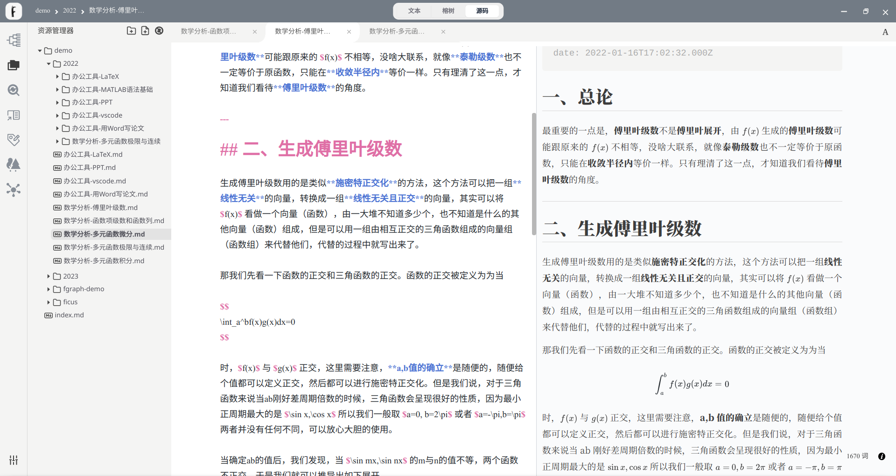
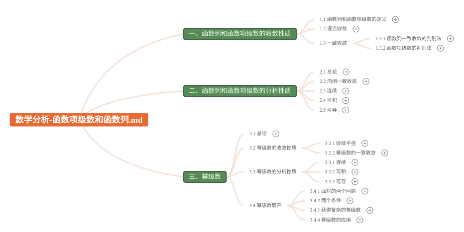
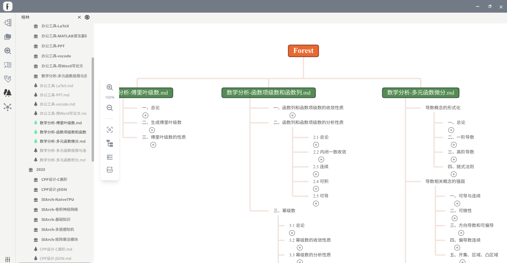
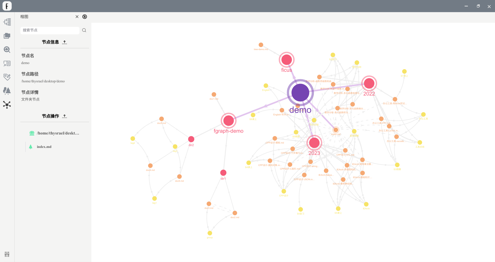
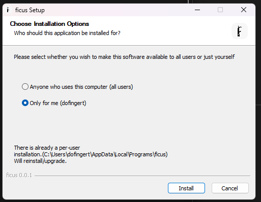

<p align = "center">

<br><br>


<br><br>
</p>

<h1 align="center">Ficus</h1>


README: [中文](./README-zh.md) | [English](./README.md)

$\tt{Ficus}$ is a software for editing and managing `markdown` documents, developed by the $\tt{gg=G}$ team.

$\tt{Ficus}$ is named after the fig tree, which has the characteristics of "umbrella-like canopy, and one tree forming a forest". This is also the core service that this software wants to provide to users: to allow users' md documents to be browsed and edited like a fig tree, and to allow users' multiple md documents to be associated in various forms like a fig forest. We hope that users' experience is like the slogan of this software:

<p align = "center">

</p>

$\tt{Ficus}$ is developed based on the `Vue3, Electron` framework and provides installation packages for Windows, macOS, and Linux systems.

Detailed information can be obtained on the [ficus website](https://ficus.world/).

## Preview

**Rich Text Mode**

<p align = "center">

</p>


**Source Code Mode**

<p align = "center">

</p>

**Ficus Tree Mode**

<p align = "center">

</p>

**Ficus Forest Mode**

<p align = "center">

</p>

**Ficus Graph Mode**

<p align = "center">

</p>


## Build

You can download the packaged application directly from the [download link](https://ficus.world/pages/53ff34/).

If you want to build it yourself, it is recommended to use the node v16.19.1 version and install the yarn package manager. Run the following commands in the shell:

```shell
git clone git@github.com:Thysrael/Ficus.git
cd ./Ficus/
yarn install
yarn electron:build
```

The resulting build can be found in `Ficus/dist_electron/linux_unpacked` or `Ficus/dist_electron/win_unpacked`.

Please note that the installation path cannot contain **Chinese**, and for Windows users, only the `Only for me` option is supported in the installation program:

<p align = "center">

</p>


## Run

It is recommended to use the node v16.19.1 version and install the yarn package manager. Run the following commands in the shell:

```shell
git clone git@github.com:Thysrael/Ficus.git
cd ./Ficus/
yarn install
yarn electron:serve
```

## Architecture

The project architecture is as shown in the figure.

<p align = "center">

</p>

The project directory structure is as follows:

```
├── build: Resources required for building
├── public: Art style resources
│   └── css
│       └── content-theme
├── src: Project source code
│   ├── common: Public resources
│   ├── IR: FicIR 
│   │   ├── block: IR basic data structure
│   │   │   ├── base 
│   │   │   │   ├── content: Node information
│   │   │   │   ├── linkedList
│   │   │   │   └── type: Type
│   │   │   └── factory: Factory method
│   │   ├── component: IR top-level data structure
│   │   ├── history: History record
│   │   ├── manager: Data manager, the only external interface
│   │   └── utils: External tools
│   │       └── marked: Markdown lexical analyzer
│   ├── main: Electron backend
│   │   ├── filesystem: File operation method
│   │   ├── helper: Utility method
│   │   └── update: Packaging method
│   └── renderer: Vue frontend
│       ├── assets: Front-end static resources
│       ├── components: Vue components
│       │   ├── header: Top bar
│       │   ├── mindEditor: Ficus mode editor
│       │   │   └── assets
│       │   ├── richTextEditor: Rich text editor
│       │   ├── sideBar: Sidebar
│       │   └── textArea: Text editor
│       ├── store: Storage
│       └── utils
│           └── keyboardbinding: Shortcut key binding
└── test: Unit test
    ├── IR: IR test
    │   ├── data
    │   ├── factory
    │   └── manager
    └── main: Main process method test
        ├── data
        └── filesystem
```

We have also rewritten the software package repositories as follows:

- [ficus-editor](https://github.com/Hyggge/ficus-editor)
- [lute-for-ficus](https://github.com/Dofingert/lute-for-ficus)
- [vue3-mindmap](https://github.com/GwokHiujin/vue3-mindmap)


## Changelog

### v0.1.0

**Release Date**: April 26, 2023

**Description**: Alpha version release.

**Features Overview**:

- WYSIWYG markdown editor
- Open files, open folders
- Basic framework setup
- Hot updates
- Supports Ficus functionality, only supports Ficus diagram display, does not support Ficus diagram editing, and does not support Ficus forest functionality
- Please do not use Ficus to open important files at will, as this version poses a certain risk of clearing user files

### v0.1.3

**Release Date**: May 7, 2023

**Description**: Improved version of the alpha version.

**Features Overview**:

- New Ficus functionality plugin
- Mathematical formula completion
- Bug fixes based on user feedback

### v0.1.8

**Release Date**: June 5, 2023

**Description**: Pre-release of the beta version.

**Features Overview**:

- Ficus functionality fully developed
- Editing floating window
- Search and replace
- Preference settings
- Shortcut keys
- Image copy and paste
- After further polishing, startup interface design, and user experience improvement, the final version of beta will be released.


### v0.1.9

**Release Date**: June 8, 2023

**Description**: Pre-release 2 of the beta version.

**Features Overview**:

- Bug fixes based on user feedback

### v0.2.0

**Release Date**: June 13, 2023

**Description**: Beta version release.

**Features Overview**:

- Bug fixes based on user feedback

## Contribution

If you are interested in our project, please feel free to join us! You can [submit an issue](https://github.com/Thysrael/Ficus/issues/new) or submit a pull request.

For specific contributions or ways to support us, please refer to [here](https://ficus.world/pages/87ba98/).

## Team

<p align = "center">

</p>

gg=G is a software engineering team consisting of seven members from the BeiHang University, School of Computer Science and Engineering, Class of 2020. This is our [team blog](https://blog.csdn.net/gg_equal_G).

## License

[MIT](LICENSE) © gg=G

