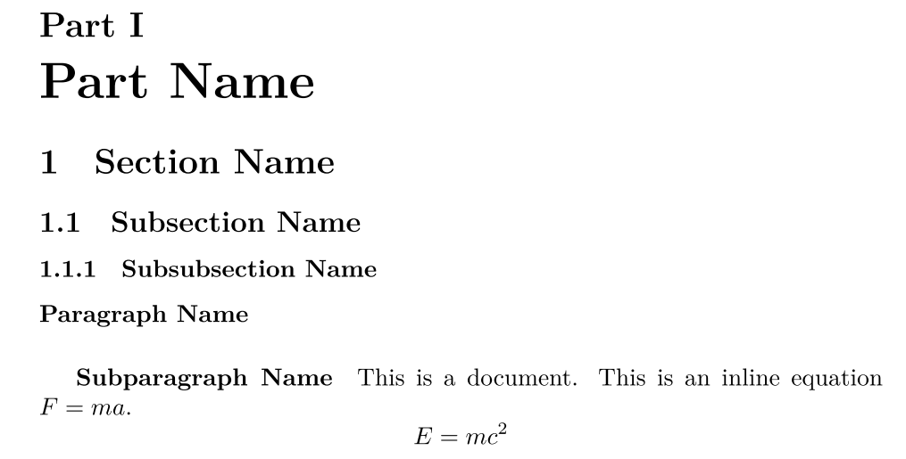
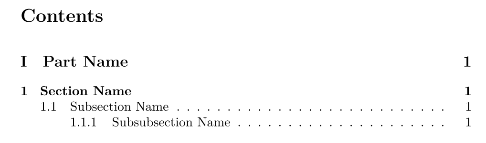
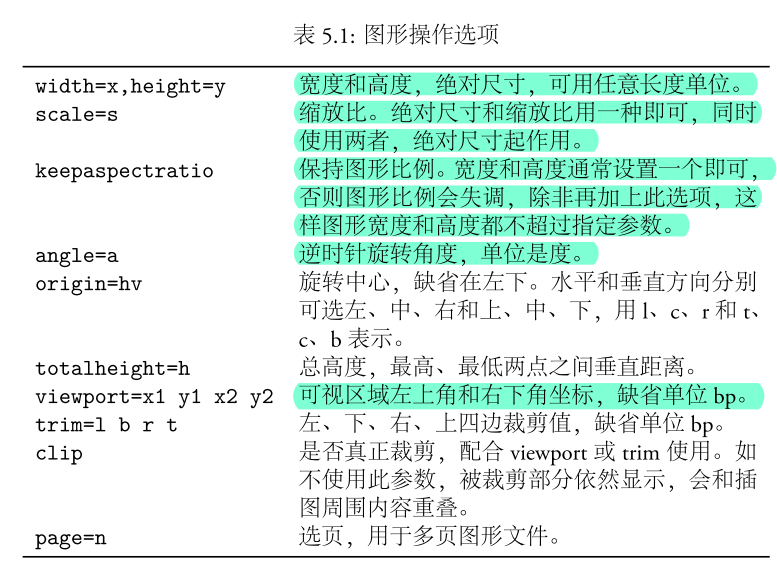
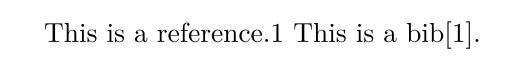
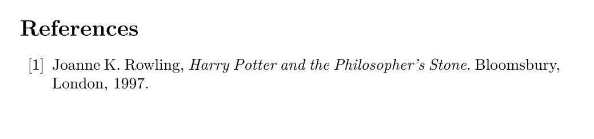

## 一、排版总论

### 1.1 缺省权力

首先，最重要最需要强调的是，

**排版是一个信息量极大的工程**。字体，格式，对齐方式，页眉页脚，都只是排版的冰山一角，可以说，一个人是没有办法完全控制一个印刷文件里面的所有排版细节的，就好像人们可以挑选衣服的颜色，款式，但是人们却对“编织手法，扣子是材质”之类的问题疏于关注，这是因为这些细节没办法全部被考量，人类的大脑接受不了这么多的信息。

由此就衍生出了排版里面我最看重的一个概念，就是“缺省”。正是由于人们没有办法关注到每一个细节，所以对于用户没有办法关注到的细节，软件开发者就必须提供“默认设置”，也就是“缺省”。当然

**理想的缺省**是没有任何问题的，人们可以随意修改自己关心的缺省设置为自己的设置，而对于自己不关心的设置就采用“默认设置”。

但是事实似乎并不是这样的，

**修改缺省设置**并不是简简单单的，我曾经为了在word中将目录调成人能看的样子，查阅各种资料查了一个小时，最后手敲的目录。由此就引出了一个基本的问题：**似乎缺省设置侵犯了用户排版的权利**。而我评价一款排版编辑工具的好坏，最重要的就是看它在我看重的的设置中**修改的难度**。

如果由此来看，现实生活中LaTeX和Word都不是很好的软件，我本人的学习中只有敲代码和写笔记两个文字编辑的

**排版需求**。而这两个需求对于排版设计没有那么多的要求，所以各种IDE和Typora可以完全满足我的需求，并不需要专业的排版软件，但是我的生活中还有一个东西叫做论文，这个东西是一个需要更多排版设计的东西（其实还有一个东西是PPT，那个东西太恐怖了）。这使就需要对LaTex和Word做出选择了。

我刚刚学完LaTex，感觉确实因为是代码化的，所以确实在

**修改**方面有很多的优势，但是也并没有说达到完全的自由，起码我觉得还是有很多东西是受到限制的，所以我现在的观点是LaTeX只是一个软件，而不是一个救星。比如说扩展包之类的东西，还是感觉用数值改的化，确实丧失了一些“**所见即所得**”的设计直观优势。

### 1.2 实践思路

练习排版最重要的是

**实践**（我坚信设计能力是在实践中增长的）。但是显然我没有那么多的实践任务，所以无论是之前看《Word排版之道》还是各种学习视频，因为始终没有跟实践结合起来，所以基本上就是看过就忘。这是没有办法的事情，我总不可能变出实践任务来，所以只能用一种**低效**的方式进行排版的学习。

不过我还是想清楚了一个很重要的事情，就是

**将文章和排版解耦联**（格式与内容分离），我可以先用Typora储存**文本信息**和文章的**层次结构**，然后再在Word或者LaTeX上考虑**排版任务**，这样分工，就可以让我在写文章的时候专注于文章的内容和结构，而在排版的时候专注于排版思想的实现。

这篇文章**第三章**可以看做是LaTeX对设计思想的一种**实现**。同样也可以看做是一组**接口**，凡是可以实现这些接口的排版工具都是可以考虑的。

此外，对于更多的排版要求，应该及时整理，哪怕是细碎的知识点，也要及时整理收纳。这不是啥系统的东西，

**设计不成系统**，系统是评论家干的事情。

---

## 二、LaTeX语法

### 2.1 语句分类

```
LaTex的源代码语句可以分为三种：
```

- **注释**：以 `%` 开头，示例如下
  
  ```latex
  % 注释语句以 % 开头
  ```
  
- **命令**：又分为**普通命令**和**环境**两种，两者主要是格式的区别
  
  - **普通命令**，以 `\` 开头，直接跟命令，示例如下：
    
    ```latex
    % format: \command[option]{content}
    ```
    
\documentclass{article}
\usepackage[dvipdfm]{graphicx}

```

- **环境**，会以 `\begin{command}[option] content \end{command}`出现，示例如下：

  ```latex
  \begin{figure}[htbp]
  \centering
  \includegraphics[width=120pt]{avatar.jpg}
  \caption{This is Rick}
```

\end{figure}

```

- **数据**，就是最普通的文本，出现于环境中或者命令中， 不能单独出现。

```

这三种语句是可以

```

**互相嵌套**的。

### 2.2 源码结构

```

源码分为两个部分，即：

```


- 序言（preamble）：用来确定一些文档的设置，如文档的类型，引用的包等：

  ```latex
  \documentclass{article} 
```

\usepackage[dvipdfm]{graphicx}

```

- 正文，在documet这个环境中的所有内容

```latex
\begin{document}
  \title{Title}   
  \author{author name}
  \date{\today}
  \maketitle
  ……
     content
     ……
\end{document}

```

---

## 三、功能

### 3.1 层次结构

```
层次结构主要包括
```

**列表的自动标号**和**目录**两个东西，关于列表自动标号，有下面的命令

```latex
\part{Part Name}
% \chapter{Chapter Name}，只要编译就会报错，是因为article里是没有章的
\section{Section Name}
\subsection{Subsection Name}
\subsubsection{Subsubsection Name}
\paragraph{Paragraph Name}
\subparagraph{Subparagraph Name}
```

```
生成的效果如图：
```



```
可以看出，能用的似乎只有section类，而且part显示的还是英文，跟中文论文的格式很不一样。
```

```
生成目录只需要两个命令
```

```latex
\setcounter{tocdepth}{2} % 设定目录深度
\tableofcontents % 列出目录
```

```
如果不想显示某一章的章节，可以如下设置：
```

```latex
\chapter*{...}
\section*{...}
\subsection*{...}
\subsubsection*{...}
```

```
效果如图
```



### 3.2 插入图片

```
需要引入一个宏包
```

```latex
\usepackage{graphicx}
```

```
插入图片的命令如下：
```

```latex
\includegraphics[option]{path}
```

```
其中option有以下选项：
```



```
然后在实际插入图片的时候，我们一般采用
```

**浮动环境**，这个环境似乎就是有利于排版调整的一个环境，具体有啥作用我不知道，每个都加上就好了，示例如下：

```latex
\begin{figure}[ht]
    \centering
    \includegraphics[scale=0.2]{avatar.jpg}
    \caption{This is Rick}
    \label{fig:avatar}
\end{figure}
```

```
这是一个比较完整的图片格式，第一行的
```

`[ht]` 表示图片的理想位置是Here和Top，还有b（bottom）和p（page单独一页）。其实我也不知道是什么意思。caption会生成标注，然后label是为了方便**交叉引用**的，但是这个交叉引用，是没有办法跳转的，好像有跳转的交叉引用需要调包，但是还有有难看的红框。这就是我不打算视LaTex为救世主的原因。

### 3.3 数学公式

```
这个部分最为简单，就是markdown里的语法就可以了，行内公式如下
```

```latex
This is an inline equation $F = ma$.
```

```
整段的公式，不再使用
```

`$$...$$` 而是如下示例：

```latex
\[
    E = mc^2
\]
```

### 3.4 标题页

```
在文档开始的时候，会有一系列的命令来设置标题页的各种东西，最后用
```

`\maketitle` 命令生成标题页，如下：

```latex
\title{Title}   
\author{author name}
\date{\today}
\maketitle
```

```
此外，对于
```

`article` 来说，是没有标题页的，标题跟正文是连续的，所以为了获得独立的标题页，需要如此设置：

```latex
\documentclass[titlepage]{article}
```

### 3.5 交叉引用

```
基础的交叉引用就是两组命令，但是我感觉不是太有用，因为是没有超链接作用的。
```

```latex
\label{labelName}
\ref{labelName}
```

```
交叉引用还有一种特殊的是
```

**参考文献**，比较基础的是这样的

```latex
This is a bib\cite{Rowling_1997}.
\begin{thebibliography}{99}
    \bibitem{Rowling_1997}
        Joanne K. Rowling,
        \emph{Harry Potter and the Philosopher's Stone}.
        Bloomsbury, London,
        1997.
\end{thebibliography}
```





```
但是可以看出不是
```

**上标**形式，我觉得我解决不了。然后更高阶的方法这里放一篇教程：https://zhuanlan.zhihu.com/p/114733612 。无论怎样，链接应该是没有办法实现的。所以这个问题让我觉得应该专注Word。

### 3.6 换页分段

换页和分段都是一个简单的命令，比word要好

```latex
\newpage % 换页
\par      % 分段
```

### 3.7 页眉页脚

```
需要调包，然后进行设置，感觉很难实现每页私人定制，这个问题跟Word上一样，真是排版的难度。
```

```latex
\usepackage{fancyhdr} % 导入fancyhdr包
\pagestyle{fancy}
% 页眉设置
\fancyhead[L]{left head}
\fancyhead[R]{right head}
\fancyhead[C]{center head}
% 页脚设置
\fancyfoot[L]{left foot}
\fancyfoot[C]{\thepage} % 页码
\fancyfoot[R]{right foot}
\renewcommand{\headrulewidth}{4pt} % 分隔线宽度4磅
\renewcommand{\footrulewidth}{4pt}
```

### 3.8 重定义命令

```
这是 LaTex 中的一种特殊用法，大概意思就是可以修改一些集成化的设置吧。格式如下：
```

```latex
\renewcommand{\新定义的命令}[参数个数]{命令内容}
```

```
比较常见的一个应用是转中文的时候，有
```

```latex
\renewcommand\contentsname{目录} 
\renewcommand\listfigurename{插图目录} 
\renewcommand\listtablename{表格目录} 
\renewcommand\refname{参考文献} 
\renewcommand\indexname{索引} 
\renewcommand\figurename{图} 
\renewcommand\tablename{表} 
\renewcommand\abstractname{摘要} 
\renewcommand\partname{部分} 
\renewcommand\appendixname{附录} 
\renewcommand\today{\number\year年\number\month月\number\day日}
\renewcommand\algorithm{算法}
```

```
当然也可以直接定义命令，格式如下：
```

```latex
\newcommand{\新定义的命令}[参数个数]{命令内容}
```

### 3.9 代码块

```
需要引入包，然后进行一系列设置，设置如下
```

```latex
\usepackage{listings} %导入包

\definecolor{codebrown}{rgb}{0.8,0.44,0.2}
\definecolor{codegray}{rgb}{0.5,0.5,0.5}
\definecolor{codepurple}{rgb}{0.58,0,0.82}
\definecolor{backcolour}{rgb}{0.95,0.95,0.92}

\lstdefinestyle{mystyle}{
    backgroundcolor=\color{backcolour},   
    commentstyle=\color{codebrown},
    keywordstyle=\color{magenta},
    numberstyle=\tiny\color{codegray},
    stringstyle=\color{codepurple},
    basicstyle=\ttfamily\footnotesize,
    breakatwhitespace=false,   
    breaklines=true,     
    captionpos=b,        
    keepspaces=true,     
    numbers=left,     
    % numbersep=5pt,
    % numbers=none,
    showspaces=false,    
    showstringspaces=false,
    showtabs=false,      
    tabsize=2,
    xleftmargin=0.1\textwidth,
    xrightmargin=0.1\textwidth
}
\lstset{style=mystyle}
```

```
代码块示例：
```

```latex
\begin{lstlisting}[language=Python, caption=Python example]
import numpy as np

def incmatrix(genl1,genl2):
    m = len(genl1)
    n = len(genl2)
    M = None #to become the incidence matrix
    VT = np.zeros((n*m,1), int)  #dummy variable

    #compute the bitwise xor matrix
    M1 = bitxormatrix(genl1)
    M2 = np.triu(bitxormatrix(genl2),1) 

    for i in range(m-1):
        for j in range(i+1, m):
            [r,c] = np.where(M2 == M1[i,j])
            for k in range(len(r)):
                VT[(i)*n + r[k]] = 1;
                VT[(i)*n + c[k]] = 1;
                VT[(j)*n + r[k]] = 1;
                VT[(j)*n + c[k]] = 1;

                if M is None:
                    M = np.copy(VT)
                else:
                    M = np.concatenate((M, VT), 1)

                VT = np.zeros((n*m,1), int)

    return M
\end{lstlisting}
```

---

## 四、模板

本来进行问前面三章的学习，内心十分绝望，觉得如此繁琐的东西，该如何是好。LaTex 比 Word 的优势在于用户对于各种设置的功能的操作权限更大，但是 LaTex 的缺点在于各种黑箱设计，弄得我想更近一步的时候，总是望而生畏。不过当学习了美赛模板之后，突然又对 LaTex 重燃了一分希望，大不了就模板改改，哪怕一开始，自己对排版的控制力不够强，也可以借鉴大佬的力量。

### 4.1 美赛模板

`mcmthesis`是专门为美赛建模论文设计的模板，各种配置都很齐全，我按照文档又将示例代码重新注释了一遍，注释一遍的过程相当的有益处，感觉对文章的理解加深了。

`.cls` 文件里是可以打开的，这个文件储存着模板信息，如果在 `.tex` 文件中改不了的东西，可以在这个文件里面查找修改，十分方便。不要怕。

放一下我的注释版：https://bhpan.buaa.edu.cn:443/link/A693742C871B6E350B3B8F36FEF91AA8

