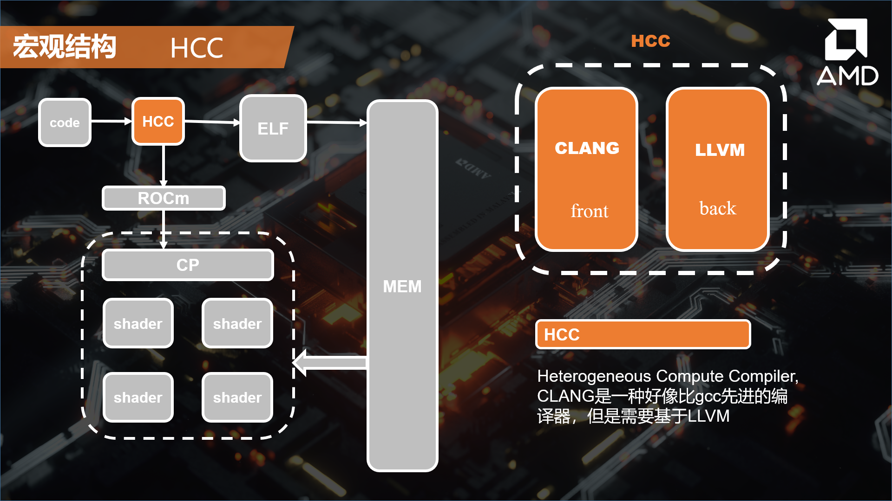

## 一、PPT 总论

### 1.1 排版解偶联

在 LATEX 的讲解中，我意识到了可以将**信息**和**排版**解偶联，在PPT的学习中，我发觉似乎可以进一步解偶联，对于排版来说，可以解偶联成**排版设计**和**排版实现**两个部分，比如说对于以下这张slide

**排版设计**指的是选用大背景，背景图片要采用发布会图片（然后具体到某一章特定的图片），标题底下要有一个衬板，衬板的颜色要选择主题色，也就是橙色，衬板要有一个比较好的透明度，衬板要选择平行四边形，因此字体应应该选择斜体，然后主标题应该加粗，右上角要采用 AMD 的图标。这些称为排版设计。

**排版实现**指的是要把上面的设计**需求**实现所需要的技术，可以是用PPT，也可以用latex，用 PPT 有很多种方法，比如说这个四边形，我可以用矩形然后调整角度实现，也可以直接用四边形工具，里面的标题，我可以直接打在四边形的形状里，也可以放一个文本框，然后里面打字。AMD的图标，我可以截图以后抠图，也可以从图标官网上下载。这些具体的实现方法就被称为**排版实现**。

为什么要将这两个部分解偶联呢，是因为这两个部分其实对能力的要求是不同的。对于**排版设计**而言，更多的要求体现在美学素养和排版积累上面；对于**排版实现**而言，更多的体现在PPT工具的流畅使用和对素材的检索能力上面。如果把制作PPT看成浑然一体的一个东西，很容易陷入“太复杂了，选择太多了，我不行”的困境，而将其分开来看，则可以逐个击破，达到提高PPT水平的目的。

### 1.2 PPT 中的信息

PPT 与论文的信息是不同的，其**本质区别**在于，论文中呈现了作者想要表达的全部的信息，而 PPT 只有作者想要表达的部分信息，另一部分信息需要通过作者的**讲演**来进行传递。所以对于呈现在 PPT 上的信息，我觉得只有两种（稍微不严谨，下一段修正），一种是**提纲**，即文本内容的提纲，表现为**无序列表**的形式；另一种是图表，用来**直观**的提供信息，图表包括：图标、图片、表格、概念图、衬板等设计元素。

此外，PPT 与 论文还有一个重要区别是论文是**静态**的，而 PPT 是动态的，这就要求 PPT 可以有时间序列上的设计（即哲学思想：人不可能踏入相同的河流）。比较直观的是动画的设计，其次还有一些**强调**设计，比如说下面的示例：

这两张幻灯片的相似度即高，可以说当进行幻灯片切换的时候，让人又一种橘色光标由 HHC 移位到 ROCm 上的感觉，这就是动态的感觉。

这只是动态的一种巧妙利用，我因为也是刚刚入门，所以只是粗浅的记录一下小小的心得，以后有机会再补充。

### 1.3 PPT 的提高

PPT 的排版设计跟所有的艺术创作一样，技术的高低跟记忆的数量有很大关系，面对一个题目，能不能迅速反应出相应的解决办法，是衡量水平的最重要评判标准。于此同时，排版设计有充满了固定性，只要稍微积累一些**套路**，就可以制作出工业级的PPT，可以说学习的周期和门槛并不高。

PPT 的排版实现其实也不难，只是市面上的教程多为**奇技淫巧**，比如说用形状画一个蒙娜丽莎之类的在实践中完全不会用到的东西，或者是极其炫酷的动画，我反正觉得没啥用。实现应该看重的是**效率**，那么其实是操作的快捷键和母版的设计占大头，这个东西，当越精越好。

---

## 二、PPT 结构

如果只是工作型PPT的话，那么可以将一个PPT的不同slide进行如下分类：

- 封面页
  
- 目录页
  
- 过渡页
  
- 正文页
  
- 结尾页
  
而每一种类型会分别对应特定的文字内容和排版设计，这个部分其实就是**套路**的积攒。

### 2.1 封面页

**全图型**的封面是心头好啊，包括的元素是

- 一张高清的背景图
  
- 一个半透明的，主体颜色的衬布（衬布要是还有边缘的衬线就更好了）
  
- 一个标题
  

**半图型**感觉会跟目录页冲突，

要是找不到图，那么可以用大色块来充数，注意后面的图案，其实是**图标放大**的效果，可以说是非常牛逼了，商务感一下子就出来了。

**图片墙**也是一种好方法，其实不用垫一层蒙版，直接选择中间部分敲标题也不是不行

### 2.2 目录页

首先明晰目录中有哪些元素

我们的设计其实就是围绕这三个元素进行的。

最简单的是**半图型**，包括：

- 半个高清图
  
- 一个主题颜色的衬板
  
- 一些分割线，用于使目录挺拔
  
- 不同小节前的图标（这个图标其实可以按时后面的内容形式）
  
- 节标题
  

当然这种形式的目录所包含的信息会比较少，而且冲击力就很弱，而且太依赖图片。

四图型对信息的包含度会更高，而且更牛逼，而且可以兼有更多的信息。

**奇异型**属于是骚出天际

如果啥图都没有的话，那么就一定要利用好图标和色块，这样才能让整个目录页显得有条理：（这个slide没有**线**的元素，加上会更好），这张还为了提高逼格，用了大写英文。

### 2.3 过渡页

这是我自己想到的，用来将演讲的结构划分的更加彻底（我不太喜欢顶部进度条的形式），所以只想出了一种设计，其实就是封面设计的退化版，这章里面用到了六边形衬布，并且把目录序号移到背景中，防止对题目造成干扰

上面这种虽然很帅，但是蕴含的信息太少了，如果PPT的体积比较庞大的话，除了每节的标题以外，还有属于每一节的小标题，其实都可以在过渡页上显示，比如：

这样处理的话，小标题信息也可以得到处理。甚至可以用“强调”的方式说明比较重要的小标题。

### 2.4 正文页

正文页比较关键的配置是“**进度提示符**”，比如说底下这个slide左上角提示这张slide属于“计算单元”这一节中的“CU结构”这一部分。

此外，正文页中因为信息会比较多，所以跟要求大量的信息能够层次分明的显示，必须有所**强调**，强调的方法比较常见的：

- 单独把强调内容放到一个色块中
  
- 用主体色强调内容
  
- 用加粗或者斜体强调
  
- 用不同字体强调
  

上面这个slide采用的是高清图加半透明蒙版的设置，我觉得还行。    

如果是大段的文本信息，那么显然适合简单的无序列表的SmartArt就没法用来摆烂了，所以可以下图方法进行处理，简约整齐：

或者再花哨一些：

### 2.5 结尾页

我个人觉得，如果是科研PPT，那么全篇没有图是一个很正常的现象，那么如果不骚一下实在难受，所以想到可以在结尾的时候骚一下。

高清图加半透明蒙版，骚一下很开行。

---

## 三、PPT 技术

### 3.1 快捷键

- `Ctrl + G` 合并形状，`Ctrl + Shift + G` 解除合并形状。
  
- `Ctrl + 鼠标点击` 拖拽多重复制。
  
### 3.2 资源网站

- 灵感：www.zcool.com.cn
  
- 图标：http://iconfont.cn （其实PPT内置的图标搜索功能还行）
  
- 高清图片搜索：https://pixabay.com/
  
- 普通图片搜索：https://cn.bing.com/images/trending?form=Z9LH（**过滤器功能强大**）
  
- 配色：https://www.materialpalette.com/colors
  
- 模板：http://www.yanj.cn/
  
有了资源网站还不够，还必须要**学会搜索素材**，比如说如果直接搜GPU，并不会跳出很多好东西，但是如果搜芯片，图片会更多，但是科技感不够，那么如果搜《黑客帝国》，那么就很容易解决问题了。如果搜索的东西是比较抽象的，比如“努力”，那么不如**联想**到其他具象的事务中，比如马拉松，但是要是我，我就搜《爆裂鼓手》。

### 3.3 使用母版

母版其实就是网上说的模板的**原理**，这是一种特殊的视图，这样打开

打开以后就会发现类似于PPT的slide，其实就是**样式**的概念，如下

有两种插入操作，一种是插入母版（就是直接插入一整套样式），一种是插入版式，就是插入一个类型（比如封面，目录页啥的）。然后当回到普通模式之后，可以用一下操作调用设置好的版式：

需要注意的是，版式的内容在正常模式下是没有办法修改的，除非使用**占位符**。

### 3.4 SmartArt

只能所SmartArt的应用很神奇，我并没有完全掌握，只能说这样可以用：

对于修改SmartArt中的内容，可以采用这种方式：

点击左侧的箭头，可以在弹出的侧栏修改内容。

---

## 四、排版思想

### 4.1 重章叠句

具体的原理已经在 1.2 节举例的时候介绍过了，就不在此赘述了。

### 4.2 配色

首先科普一下颜色的知识，颜色有三个维度：**色相，明度，灰度**，色相就是用三原色不同比例调出来的颜色，明度是往颜色里面混黑色或者白色，灰度是往颜色里面混灰色。

然后关于不同颜色的关系，大概就是这样：

同一个PPT，最好不出现多于5中颜色，而且最好确定一个主题色。

### 4.3 字体选择

一般所有的字都用黑体，黑体中我偏爱微软雅黑。

