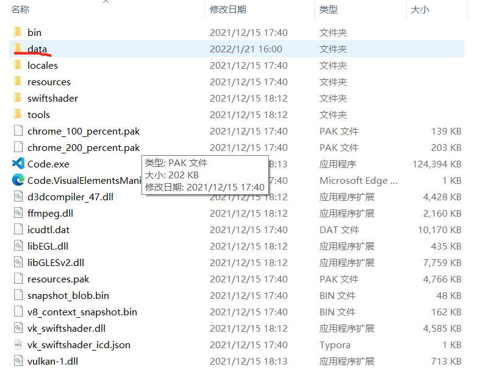

## 一、快捷键使用

- 如果鼠标不选择某个特定区域，那么此时的复制粘贴删除都是对于一行进行的。
- `Ctrl + L` ：选中特定的一行，如果一直按住，可以选择多行。
- `Ctrl + /`：注释掉选中的区域，使用的是**单行注释**的方式，再按取消注释。
- `Alt + Shift + a` ：注释掉选中区域，使用的是**多行注释**的方式，这个按键，可以用右手按 `Alt + Shift` 相当舒服。
- `Ctrl + d`：选中光标所在的单词。
- `F11`：全屏。
- `Ctrl + Enter `：无论光标在哪里，直接重起下一行。
- `Shift + Alt + F`：格式化代码。

---


## 二、配置 vscode

### 2.1 改变插件安装的位置

​	如果是默认设置，那么插件会安装在C盘，这显然是我们不想看到的。所以我们要把插件安装到我们希望其在的文件夹中（起码不在C盘）。

​	在网上有一种是用命令行的方法，即 `--[extensions-dir][path]` 的方法，但是这种方法有很多的弊端，比如直接打开文件的时候没有办法启用插件之类的，我没有调好。

​	所以比较好的方法是下载vscode的时候，用 zip 包下载，如下


​	这种 vscode，在根目录下创建一个 `data` 文件夹，所有的插件就都会保存到这个里面了。如下：



### 2.2 将终端设置成 git-bash

​	需要先将git-bash添加入终端，之前有一种方法是不行的，会提示

```json
This is deprecated, the new recommended way to configure your default shell is by creating a terminal profile in `#terminal.integrated.profiles.windows#` and setting its profile name as the default in `#terminal.integrated.defaultProfile.windows#`. This will currently take priority over the new profiles settings but that will change in the future.
```

​	所以要采用新的方法，将settings-json文件如下配置

```json
{
    //这里是我的配置，不用管
    "workbench.colorTheme": "Noctis",
    "editor.fontSize": 17,
    "editor.fontFamily": "JetBrains Mono NL, 'Courier New', monospace",
    "window.zoomLevel": 0.8,
    "editor.mouseWheelZoom": true,
    //这里是将默认终端设置为git-bash
    "terminal.integrated.defaultProfile.windows": "git-bash",
    //这里是添加git-bash进入终端选择列表
    "terminal.integrated.profiles.windows": {
        "git-bash": {
            "path": "source\\Git\\bin\\bash.exe" //这里是自己的安装路径
        }
    },
    //这是使用git的时候的路径
    "git.path": "D:\\github\\Git\\bin\\git.exe"
}
```

### 2.3 vscode 插件

#### 2.3.1 drawio

​	是一个画流程图的软件，新建一个文件后缀名改成 `.drawio` ，然后右键该标签，选择用 `Reopen Editor With` 就可以选择 drawio打开，然后输出的时候选择 `File -> Export` 即可。


### 2.4 设置编码方式

​	因为vscode的默认编码方式是 `UTF-8` ，而可能我记得dev C++和 ISE 的默认编码方式都是 `GB` 所以会出现乱码，可以一个一个自己调，就是点击右下角的 `GB 2312` 然后就会在上面弹出这个框，选择 “Reopen with Encoding”。就可以进行编码方式的选择


​	如果想要方便一点，可以选择 `file -> preferences -> settings -> atuo guess encoding` 将其修改为 ture，即可自动识别。

---


## 三、vscode 与 git

​	依然还是只能实现很笨拙的操作，没有办法向不同名的分支上进行提交，只能老老实实的提交同名分支，不过界面确实美化了很多，而且出现了很多图像化界面，所以操作变简单了，但是概念还是原来的概念


​	左面的Changes就是工作区，如果修改完代码保存以后，那么工作区就会记录这个变化，可以选择 `+` 将其提交到**暂存区**，变化就成了 Staged Changes，原来的工作区就是 Unstaged Changes，然后点击上面的对勾就可以提交到版本库，然后点击 `……` 就可以选择提交到远端。

---


## 四、编译环境配置

### 4.1 C/C++环境

​	这个东西，是一个项目就必须配置一个 `.vscode` 文件，所以我装完以后尝试了一下，成功以后就放弃了，因为实在是太麻烦了，但是多亏了肖哥哥给我安利了这个软件，这个软件可以自动化配置 `.vscode` 文件。用起来爽歪歪。

​	

​	软件地址：https://bhpan.buaa.edu.cn:443/link/BC026B1210B84413D35EAC66A7A153E1

​	除了这个软件以外，应该还需要在vscode上安装关于C的插件，但是不难，就跟着提示来就好了。

调试快捷键：

- 编译调试：`F5`
- 单步运行：`F10`

​	在写C++代码的时候可能会用到**万能头文件** `bits/stdc++.h`，然后vscode就会报错，所以需要找到如下地址 `\mingw64\lib\gcc\x86_64-w64-mingw32\8.1.0\include\c++\bits` ，然后在里面新建一个名为 `stdc++.h` 的文件，里面的内容如下所示：

```c++
// C++ includes used for precompiling -*- C++ -*-
 
// Copyright (C) 2003-2015 Free Software Foundation, Inc.
//
// This file is part of the GNU ISO C++ Library.  This library is free
// software; you can redistribute it and/or modify it under the
// terms of the GNU General Public License as published by the
// Free Software Foundation; either version 3, or (at your option)
// any later version.
 
// This library is distributed in the hope that it will be useful,
// but WITHOUT ANY WARRANTY; without even the implied warranty of
// MERCHANTABILITY or FITNESS FOR A PARTICULAR PURPOSE.  See the
// GNU General Public License for more details.
 
// Under Section 7 of GPL version 3, you are granted additional
// permissions described in the GCC Runtime Library Exception, version
// 3.1, as published by the Free Software Foundation.
 
// You should have received a copy of the GNU General Public License and
// a copy of the GCC Runtime Library Exception along with this program;
// see the files COPYING3 and COPYING.RUNTIME respectively.  If not, see
// <http://www.gnu.org/licenses/>.
 
/** @file stdc++.h
 *  This is an implementation file for a precompiled header.
 */
 
// 17.4.1.2 Headers
 
// C
#ifndef _GLIBCXX_NO_ASSERT
#include <cassert>
#endif
#include <cctype>
#include <cerrno>
#include <cfloat>
#include <ciso646>
#include <climits>
#include <clocale>
#include <cmath>
#include <csetjmp>
#include <csignal>
#include <cstdarg>
#include <cstddef>
#include <cstdio>
#include <cstdlib>
#include <cstring>
#include <ctime>
 
#if __cplusplus >= 201103L
#include <ccomplex>
#include <cfenv>
#include <cinttypes>
#include <cstdalign>
#include <cstdbool>
#include <cstdint>
#include <ctgmath>
#include <cwchar>
#include <cwctype>
#endif
 
// C++
#include <algorithm>
#include <bitset>
#include <complex>
#include <deque>
#include <exception>
#include <fstream>
#include <functional>
#include <iomanip>
#include <ios>
#include <iosfwd>
#include <iostream>
#include <istream>
#include <iterator>
#include <limits>
#include <list>
#include <locale>
#include <map>
#include <memory>
#include <new>
#include <numeric>
#include <ostream>
#include <queue>
#include <set>
#include <sstream>
#include <stack>
#include <stdexcept>
#include <streambuf>
#include <string>
#include <typeinfo>
#include <utility>
#include <valarray>
#include <vector>
 
#if __cplusplus >= 201103L
#include <array>
#include <atomic>
#include <chrono>
#include <condition_variable>
#include <forward_list>
#include <future>
#include <initializer_list>
#include <mutex>
#include <random>
#include <ratio>
#include <regex>
#include <scoped_allocator>
#include <system_error>
#include <thread>
#include <tuple>
#include <typeindex>
#include <type_traits>
#include <unordered_map>
#include <unordered_set>
#endif
```


### 4.2 Python

​	vscode似乎不用配置任何东西就可以解释python代码，但是我没有试过debug需不需要，不过给我的感觉就是没有pycharm好，对于Java也有类似体验。
