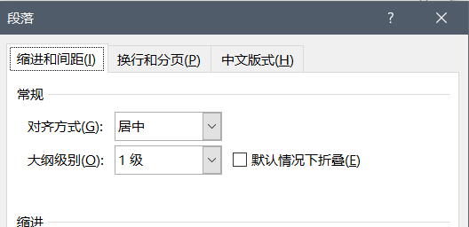

## 一、分节分页

​	首先要把**分界分页**的**标识符**调出来，这样方便排版，方法是“文件—选项—显示—显示所有格式标记”。

​	然后明晰一下**分节**和**分页**的概念，**分节**指的是一种**文章逻辑**上的分割，用这种**分割**方式分割出的部分，可以具有不同的**页眉，页脚，尾注**。而对于**分页**来讲，只是**物理**层面的分割，一般的应用于比如封面，摘要，目录，参考文献的分割。

​	**分节**一般有两种，**下一节**和**连续**，理论上来讲，**下一节**操作等价于**连续分节符**和**分页符**，但是在实际操作过程中，**下一页分节符**会造成空白页的出现，为了避免麻烦，还是用连续分节符为妙。在写冯如杯的论文的时候，分节操作应该在进行其他操作之前做，因为其他操作有可能依赖于分节操作，比如**制作目录，参考文献，制作页码页眉**等。在这种论文中，一般分为三节，第一节包括封面，中英文摘要，目录，主要原因是区分页码。第二节部分包括正文和参考文献，第三部分是致谢，主要原因是参考文献的**尾注引用**问题。

## 二、样式

​	采用样式不是必须的，甚至在北航官方提供的文档中，都没有采用样式，而是对字体进行单独的设置。采用样式及一系列操作的原因其实代表着一种设计思想，即**动态管理与自动化排版**。采用这种思想可以使排版更加有效率，有条理，但是就我个人经验来说，因为冯如杯论文结构较为简单，而自动化排版学习较为复杂，要是时间紧，或者没师傅带，可以不学习这种知识，笔者自己就是因为学的半瓶子醋晃荡，导致了冯如杯差点没有参赛成功，而笔者的好朋友就采用了直接设置的方法，获得了一等奖好成绩。

​	样式的设置建议依然是在**创作论文之前**，设置好在写，可以更加方便，因为设置**多级列表**需要先设置样式。冯如杯的论文一般需要设置六种，即**标题、标题1、标题2、标题3、题注、正文**，**标题**对应的是**摘要，目录，参考文献，致谢**这几个字；**标题1**对应的是**章标题**，**标题2**对应的是**节标题**，**标题3**对应的是**条标题**，**题注**对应的是**题注，参考文献的具体内容**。

​	样式设计的具体内容有很多项，首先设置**正文**，因为其他样式都是**基于正文样式**设置的，样式的类型要选**链接段落和字符**，因为最为灵活。需要注意的是设置一般在“修改样式—格式”中设置，因为这里的选项更多设置。正文就要把中英文的差异设置好了，免得出问题。

​	**标题**和**标题1**的大纲级别都要设置成**1级**，之所以要区分这两个样式，因为**标题1**要参与**多级列表的链接**，大纲级别的设置在段落中设置。**标题2**和**标题3**的大纲级别要设置成**2级和3级**。

​	这是最痛苦的部分，因为会存在大量的问题，比如**节标题和条标题难以对齐**、**标题号和标题内容相差过远**、**汉字标号和阿拉伯数字不兼容**，这些问题都会在下面得以解决。

​	最基本的操作是“开始—段落—多级列表—定义新的多级列表”。注意设置的时候要点开**更多**选项，才能满足设置的要求。

​	三级标题设置如下，注意一下几点，**第一级**的时候要不要勾选**正规化形式编号**，但其他级别要勾选，可以解决**汉字标号和阿拉伯数字不兼容**的问题。缩进位置要改为0，避免格式混乱。不要删除**输入编号的格式**中的内容，只能添加内容，如标题1中的顿号，这样才能保证**动态管理**。其他的设置要与截图一致。

​	此外，还要设置“设置所有级别”中的内容，要把所有选项都设置为0，这样才能解决**节标题和条标题难以对齐**的问题。

​	但是有的时候还是没有办法解决问题，那么就需要人为插入**制表位**，只需要把出现**标题号和标题内容相距过远**的标题，将光标选在标题内容的首位，然后点击**标尺**，就可以插入**制表位**，然后移动**制表符**直至合适位置就好了。

## 四、题注尾注

​	题注解决的是图和表的插入问题，操作简单，字体格式也可以稍后设置。

​	对于**尾注**，解决的是**参考文献**的动态引用问题。基本操作是打开“引用—脚注”设置栏，然后如下设置。之所以需要设置在**节的结尾**，因为要有**致谢**，所以设置在**文档的结尾**会造成混乱。另外，理论上讲，尾注的内容不属于正文。

​	但是还需要进行两个问题的解决，一个是给**标号加方括号**，另一个是**去掉尾注之前的横线**。

​	对于第一个问题，可以采用两次**替换操作**完成，一次是**正文**内容，一次是**尾注**内容，**两次的原因**就是因为尾注的内容不属于正文。**替换**操作按如下进行，两次相同。

​	解决另一个问题，需要先“选”视图—草稿“模式，然后在选择”引用—显示备注“，最后在下面删除**尾注分隔符**等一系列内容。操作如下：

## 五、页眉页脚

​		重点在于前面的**分节**操作，只需要设置好以后，取消“设计—导航—链接到上一节”即可。

## 六、目录

​	这个没有查得到比较良好的资料，**自动化**的程度较低，只能说按下面操作生成目录后，把目录当成普通的段落调节**字体和段落**即可。

## 七、模板

​	经历了如此的折磨以后，考虑到冯如杯要写很多次，所以最好的方法就是把它当成**模板**，以方便下次的使用。

​	**创建模板**的操作如下，选择“文件—另存为—将格式存为.dotx”：

​	**使用模板**的操作如下，选择“文件—新建—个人”：

