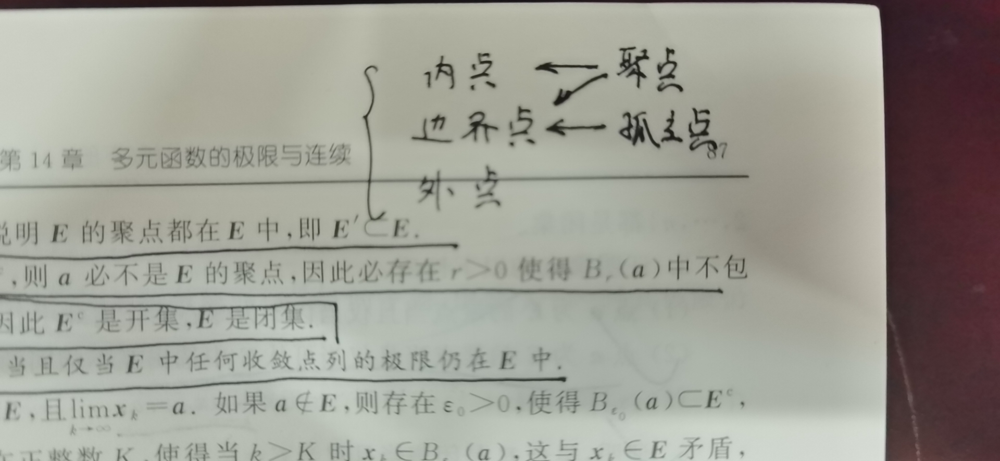

## 一、基本概念

### 1.1 总论

我觉得进到多元范畴，有两点是重要的，一个是**形式的统一**，另一个是**条件的强弱**。**形式的统一**有两个方面，一个是把**新的概念**用**旧的概念**解释，一个是将**旧的概念，狭义的概念**用**新的概念，普世的概念**重新理解，这一部分我做的还可以。**条件的强弱**做的不够好，在讨论单元函数条件的时候，就没有可以与新学的知识**互相启发**的可能。条件的强弱是应该有感情的，我在**新学的知识**的条件方面做的还可以，可以弥补部分基础知识，但是对于高深的知识，比如**泰勒，积分**在级数方面的应用，就十分不敏感。

### 1.2 距离

首先应当明确，**距离**并不是每一个空间的**必要特征**，但是是进行**数学分析**的必要特征。定义**距离**需要**内积**的概念，内积衍生出了**距离**和**角度**两个概念。所以其实**距离**并不是基本概念，但是显然**距离**才比较与数学分析体系**兼容**，**角度**只在**正交**的时候才比较明显。距离在一元函数中表现为**绝对值**，要注意这种概念的迁移性。

### 1.3 有界

就是有一个**球**可以把整个集合**包进去**，球的半径就是刚才定义过的**距离**。

### 1.4 极限

极限也是很好定义的，就是在一个**一定小的开球**里，里面的值都是跟某个值的**距离任意小**。我列于此是想强调，极限是**最弱的条件**，其上是**连续**，说的是在一个**开球附近的值**距离**开球圆心的值**任意小，它限定了某个值必须是该点的函数值，同时提供了一种求极限的方法，就是代值进函数，因为在一元时，函数基本上都是连续的，所以求极限显得很显然，而且我们还有一大堆好使的工具，比如**洛必达、泰勒、等价无穷小**。反正就是大概都不会**用定义来求**极限，但是在**多元函数中**，洛必达是**偏导**，而不是**微分**，所以没法用于极限。**泰勒**是微分，但是各种项数过多，即使转换成多项式，也很难求极限。**等价无穷小**倒是在化简函数结构的时候有用，但是基本上十分显然。所以难点其实就是**利用定义证明**，那么**放缩**，**利用条件**就是重中之重，也是这**全节的难点**。

### 1.5 各种点

#### 1.5.1 内点

如果有一个以某一点为球心的**一定小的开球**包在这个集合中，就称这个点是集合的内点。内点是一定在**集合内部的**，这也是它姓名的由来。我们管由内点组成的集合叫做**开集**，开集的**补集**叫做**闭集**。

#### 1.5.2 边界点

如果有一个以某点为圆心的**任意开球中**都有这个集合中的点，又有不是这个集合中的点，那么就称这个点是**边界点**，注意边界点可能属于这个集合，也可能不属于这个集合。我们管由边界点组成的集合叫做集合 $E$ 的**边界**，记作 $\part E$ 。这种记法需要记忆。

### 1.5.3 外点

如果有一个以某一点为球心的**一定小的开球**包在这个集合的补集中，就称这个点是集合的外点。外点一定在**集合外部**。

#### 1.5.4 聚点和孤立点

如果对于一个以某点为球心的任意的空心开球中，都有集合中的点，那么就称这个点为**聚点**，聚点可以不在集合中，如果一个点在集合中而不是聚点，那么他就是孤立点。也就是说**孤立点一定在集合中**。

#### 1.5.6 各种点的关系

### 1.6 各种集合

#### 1.6.1 开集和闭集

注意到**开集**并不等价或者相似于**开区间**，它更像**开覆盖**的概念，因为集合并没有要求里面的点必须构成一个**整体**，它可能是多个**范围**的并集。

有限多个开集的交是开集，任意多个开集的并是开集。任意多个闭集的交是闭集，有限多个闭集的并是闭集。

#### 1.6.2 区域和道路联通

为了形容我们认知中的一个**范围**，我们给了**区域**的概念，它等价于**开区间**，**区域**的闭包被称为闭区域。注意不是**道路联通的闭集**。比如
$$
\{(x,y)|xy>=0\}
$$
它就不是一个**闭区域**，这是因为 $xy>0$ 不是一个**开区域**，因为没办法经过**原点**，第一三象限就没有办法沟通。

**道路联通**就是为了形容**一个范围**引入的概念。

#### 1.6.3 导集

**导集**是集合 $E$ 所有聚点的集合，因为聚点有可能属于 $E$，也有可能不属于，所以导集有的时候比集合大，有的时候比集合小，比如**开集的导集**就比原集合大（加了边界点），但是一个点的导集就比原集合小（导集是∅）。

导集一定是闭集。

当导集属于原集合的时候，原集合一定是闭集。

#### 1.6.4 闭包

正因为**导集和原集合**忽大忽小，所以如果将它们**取并**，就可以得到一个**最大的集合**了，也就是**闭包**。**闭包**的抽象意思大概是**由原集合拓展出来的，具有某种性质的集合**。所以他一定**比原集合大（不小）**，且具有**闭集**的性质。

闭包一定是**闭集**。是建立在前面的导集的性质上的一个显然事实。

-----

## 二、连续与极限

### 2.1 总论

还是要强调，**极限存在**是**连续**、**导数**、**积分**的基础。所有的问题大多转化成极限问题。

### 2.2 重极限和累次极限

重极限就是不断小的圆盘中确定的值，而累次极限是沿一条线趋于那个点，进而得到那个极限值。**重极限**和**累次极限**的条件没有**强弱之分**。这是因为两者都对取极限的过程做出了**不同的限制**。对于**重极限**，x和y的变化必须是**同时的**，是一起的。对于累次极限，必须先把一个**定死**，这限制了其他的可能，有的甚至办不到，比如函数里面有 $\sin(\frac{1}{x})$ 的结构，在重极限中可以放缩，但是累次极限不可以。

### 2.3 极限存在和不存在

证明极限存在在前面已经论证过了难度，所以大致的方向一般分为两种。一种是不等式放缩。
$$
xy<\frac{(x+y)^2}{4}<\frac{x^2+y^2}{2}
$$
可以看得到，代表**距离**的平方和是在最后的，这为放缩提供了优势，然后一般还会结合三角函数，对于 $\sin x$ 可以放成 x ；对于 $\sin(\frac{1}{x})$ ，可以放成 1。这样就可以处理一般的题目了。

还有一种方法是**极坐标代换**，只要里面的 $\theta$ 不影响极限值，就可以证明极限存在。

对于证明极限不存在，总的思路是这样的，沿某个方向去取极限（不一定是直线，还可以是曲线），发现极限不存在或者两个极限不存在。

对于证两个极限不同，对于分子是**乘积形式**的，有一个极限肯定是0，在代一个 $y=x^a$ 使得分子和分母**最低次数**相等，比如
$$
\lim_{n\rightarrow\infty}\frac{x^2y^2}{x^3+y}
$$
可以代 $y=x^{\frac{1}{2}}$ 虽然有违我的本意，但是好像现在证出极限不存在来了。

也可以用 $y=kx$ 就可以证出一些问题，也可以用极坐标代换，实在不行在构造多项式。