# 实验报告

## 一、实验原理

### 1.1 项目架构

相比于 lab4 只有 Bram 是在板子上，而 PL 采用软件模拟的，这次 PL 侧我们利用 FPGA 实现了，也就是真正完成了一个简单的乘法运算加速器。

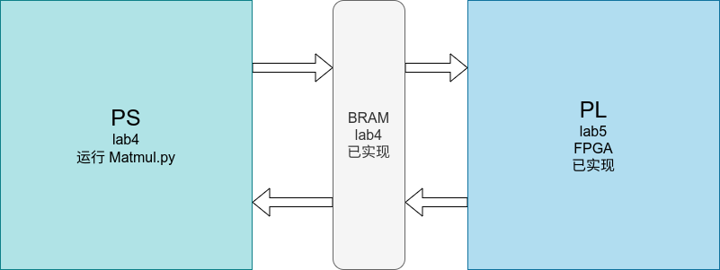

​	PL 侧架构如图所示:

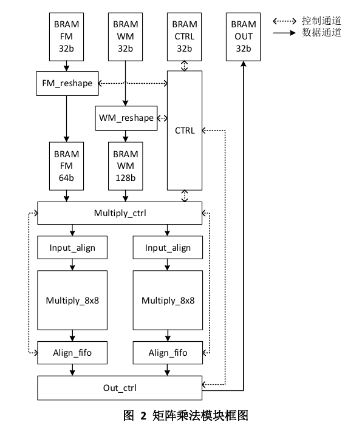

可以看到，依然是利用 bram 进行通信。用到了在 lab3 中开发的 MAC 模块。

### 1.2 矩阵乘法

在 lab3 的时候我们开发了 8x8 的矩阵乘法模块，可以用计算 $A_{8 \times N} \cdot B_{N \times 8}$ 的矩阵乘法，其中 $N$ 可以是任意值。

由于 FPGA 的硬件资源的限制，我们在板子上实现 2 个 8x8 的矩阵乘法模块，由矩阵乘法的性质很容易得出，2 个 8x8 的矩阵乘法模块等价于一个 8x16 的矩阵乘法模块，也就是说，可以计算 $A_{8 \times N} \cdot B_{N \times 16}$ 的矩阵乘法。

但是我们实际的需求是计算  $A_{M \times N} \cdot B_{N \times P}$  ，所以需要对这两个矩阵分块，分块的方法就是 $A$ 矩阵横着分（适应 $8 \times N$ ）$B$ 矩阵竖着分（适应 $N \times 16$ ）。如图所示：

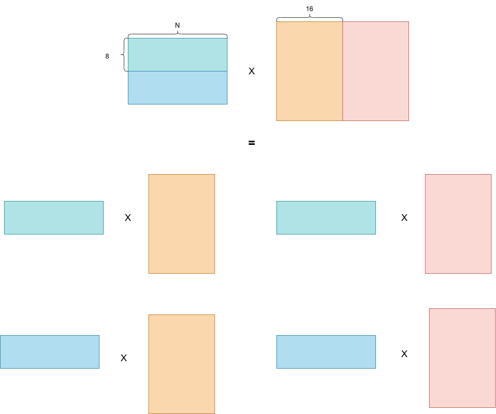

对于不足 8 和 16 的输入矩阵，需要补齐。

### 1.3 对齐

对齐有很多种实现方式，比较方便的就是补零操作，比如说需要进行 8 对齐，而数据宽度只有 1 位，那么就可以补充 7 位的零。本次 lab 的基础部分就是采用这个方法实现的。

如果比较本质的看，对齐操作应当是与数据接受方的需求有关，本次 lab 一共有两个数据接收方，一个是沟通 PS 和 PL 的 Bram，是 32 位的，一个是 8x16 的乘法单元，是 32 位对齐和 64 位对齐的，所以补零操作发生了两次，第一次在 `Matmul.py` 中，如下代码，是 32 对齐的。

```python
def send_data(self, data, block_name, offset='default'):
    """
    写入 input 或 weight 至 bram
    假设两个矩阵分别是 (m,n) x (n,p), m 和 p 的维度需要补全至 self.systolic_size 的倍数，
    并且写入时需要按照补零的方向写入，例如：
        1. 矩阵 (m, n) 是 m 补零，则 m 个 m 个写入BRAM中。（行方向补零，列方向写入）
        2. 矩阵 (n, p) 是 p 补零，则 p 个 p 个写入BRAM中。（列方向补零，行方向写入）
    Args:
        data: 要写入的数据
        block_name: input, weight
        offset: 偏移地址名称，默认为default
    """
    # padding
    if block_name == 'input':
        # M x N
        m, n = data.shape
        self.ori_m = m
        # padded m 是需要在 m 方向上补零的个数
        self.paddedm = self.systolic_size * (m // self.systolic_size + 1) - m
        padd = np.zeros((self.paddedm, n), dtype=np.uint8)
        padded = np.append(data, padd, axis=0).T
        self.paddedm += m
    else:
        assert block_name == 'weight'
        # N x P
        n, p = data.shape
        self.ori_p = p
        self.paddedp = self.systolic_size * (p // self.systolic_size + 1) - p
        padd = np.zeros((n, self.paddedp), dtype=np.int8)
        padded = np.append(data, padd, axis=1)
        self.paddedp += p
    self.n = n
    self.bram.write(padded, block_name=block_name)
    pass
```

第二次是在 `FM_reshape.v` 和 `WM_reshape.v` 模块，如下代码

```verilog
always @(posedge clk or posedge rst) begin
    if (rst) begin
        BRAM_FM64_wrdata <= 'b0;
    end
    else if ((c_state==WORK)&&(cycle1_cnt[0]==1'b1)) begin
        BRAM_FM64_wrdata <= {BRAM_FM32_rddata,BRAM_FM64_wrdata[31:0]};
    end
    else if (c_state==WORK) begin
        BRAM_FM64_wrdata <= {32'b0,BRAM_FM32_rddata};
    end
    else begin
        BRAM_FM64_wrdata <= BRAM_FM64_wrdata;
    end
end
```

## 二、实验流程

### 2.1 仿真流程

本次实验所需要的工程示例已提供，所以不需要再改动 Verilog 源码了。

对于仿真流程，需要 ` Gen_matrix.py` 产生输入矩阵，然后利用 ` MM_top_tb.v ` 作为 ARM 的模拟激励测试平台，然后测试即可，最后利用 `compare.py` 进行比对。

输出为

```shell
data right
```

### 2.2 上板流程

生成 bit 流后上板，需要用到 lab4 的 `Matmul.py` ，最后效果如图

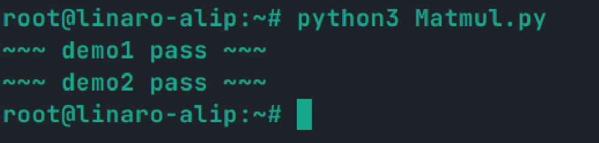

---


# 思考题

## 1

有如下约束
$$
M \times N \leq 8 \times 4096 = 32768\\
N \times P \leq 16 \times 8192 = 131072
$$
取等条件是 `M % 8 == 0, P % 16 == 0` 。软件 padding 是根据脉冲矩阵的大小进行的，所以是 4 补零，硬件补零是按照 $8 \times 16 $ 的乘法单元进行补零的，为了取等，不能补零，所以是上面的条件。

这是因为 BRAM 的配置如下：

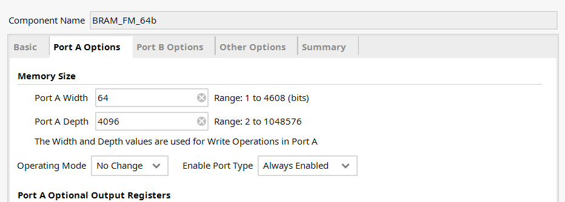


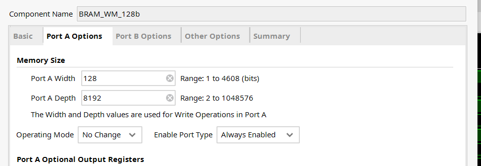


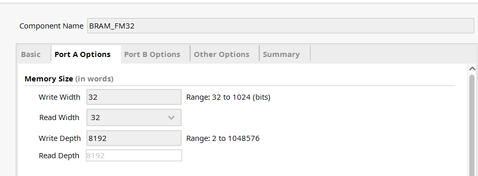


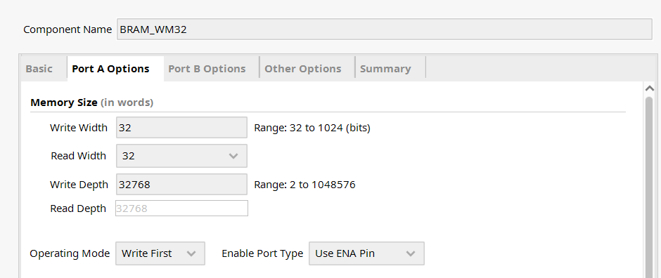

> 关于补零：
>
> 可以看做是对齐的具体实现方式，对齐应该看输入端口的需求位宽，
>
> 对于第一次补零，是向 BRAM_32 传输信号，所以是 32 bit 对齐，所以是 4 补零，这次补零由与 BRAM_32 通信的 PS 完成（也就是 python 模拟）
>
> 对于第二次补零，是向 BRAM_FM_64 和 BRAM_WM_128 传输信号，所以 64 bit 和 128 bit 对齐，所以是 8 补零和 16 补零，这次补零由与 BRAM_FM_64 和 BRAM_WM_128 通信的 reshape 模块完成。

---


## 2

均是足够的。

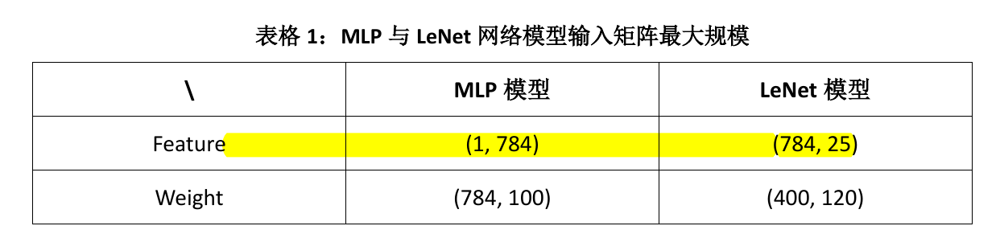

由计算可得 Feature 和 Weight 矩阵中的最大元素个数分别是（需要按照 4 补零，但是恰好是对齐的）：
$$
feature\_max = 784 \times 25 = 19600\\
weigth\_max = 784 \times 100 = 78400
$$
BRAM_FM32 可以容纳的最大元素个数
$$
8 \times 8192 = 65536 \geq 19600
$$
所以大小是足够的。

BRAM_WM32 可以容纳的最大元素个数
$$
8 \times 32768 = 262144 \geq 78400
$$
所以大小是足够的。

BRAM_FM_64 可以容纳的最大元素个数是 $32768 \geq 19600$ ，所以大小是足够的。

BRAM_WM_128 可以容纳的最大元素个数是 $131072 \geq 78400$ ，所以大小是足够的。

---


## 3

可以通过一个固定维数的二维数组，模拟矩阵，然后利用 `for` 循环，完成矩阵乘法操作。

```verilog
reg [0:7]   feature[0:200][0:200];
reg [0:7]   weight[0:200][0:200];
reg signed [0:31]  result_std;
reg [0:31]  result_sim[0:20000];
reg [0:0]  right;

integer i, j, k, r;

// 初始化，生成待计算的矩阵大小以及矩阵元素
initial begin
    while(1) begin
        wait(c_state==IDLE);
        // 初始化矩阵大小
        M = 2 + {$random} % 20;
        N = 2 + {$random} % 20;
        P = 2 + {$random} % 20;
//        M = 4;
//        N = 4;
//        P = 4;
        

        FM_reg_valid = 1'b0;
        FM_reg0 = 'b0;
        FM_reg1 = 'b0;
        FM_reg2 = 'b0;
        FM_reg3 = 'b0;
        wait(c_state==WRITE_FM);
        // 生成矩阵 feature
        for(j = 0; j < N; j=j+1) begin
            for(i = 0; i < M; i=i+4) begin
                @(posedge arm_clk)
                FM_reg_valid = 1'b1;
                {FM_reg0, FM_reg1, FM_reg2, FM_reg3} = $random;

                if(i + 1 >= M) begin
                    FM_reg1 = 0;
                    FM_reg2 = 0;
                    FM_reg3 = 0;
                end 
                else if(i + 2 >= M) begin
                    FM_reg2 = 0;
                    FM_reg3 = 0;
                end 
                else if(i + 2 >= M) begin
                    FM_reg3 = 0;
                end
                feature[i][j] = FM_reg0;
                feature[i + 1][j] = FM_reg1;
                feature[i + 2][j] = FM_reg2;
                feature[i + 3][j] = FM_reg3;
                
            end
        end    
        
        WM_reg_valid = 1'b0;
        WM_reg0 = 'b0;
        WM_reg1 = 'b0;
        WM_reg2 = 'b0;
        WM_reg3 = 'b0;
        wait(c_state==WRITE_WM);
        // 生成矩阵 weight
        for(i = 0; i < N; i = i + 1) begin
            for(j = 0; j < P; j = j + 4) begin
                @(posedge arm_clk)
                WM_reg_valid = 1'b1;
                {WM_reg0, WM_reg1, WM_reg2, WM_reg3} = $random;

                if(j + 1 >= M) begin
                    WM_reg1 = 0;
                    WM_reg2 = 0;
                    WM_reg3 = 0;
                end else if(j + 2 >= M) begin
                    WM_reg2 = 0;
                    WM_reg3 = 0;
                end else if(j + 2 >= M) begin
                    WM_reg3 = 0;
                end
                weight[i][j] = WM_reg0;
                weight[i][j+1] = WM_reg1;
                weight[i][j+2] = WM_reg2;
                weight[i][j+3] = WM_reg3;
            end
        end 
        r = 0;
        // 计算并对比
        
        wait(n_state==FINISH);
        wait(r == M * P);
        arm_work = 1'b0;
        right = 1'b1;
        for(i = 0; i < M && right; i = i + 1) begin
            for(j = 0; j < P && right; j = j + 1) begin
                result_std = 0;
                for(k = 0; k < N; k = k + 1) begin
                    result_std = result_std + $signed(weight[k][j]) * $signed({8'b0,feature[i][k]});
                end
                if(result_std != result_sim[i*P + j]) begin
                    right = 1'b0;
                end
            end
        end                
        if (right)
            $display("passed test %dx%dx%d\n", M, N, P);
        else
            $display("notpass test %dx%dx%d\n", M, N, P);
        
        arm_work = 1'b1;

    end
end
```

同理，也可用 `for` 循环完成检验操作。

---


## 4

因为直接与 BRAM_FM_64 和 BRAM_WM_128 通信，所以需要在 PL 侧完成新的对齐操作（也就是补零）。之前的代码是 4 字节对齐，需要被修改为 8 对齐和 16 对齐，所以需要对 `Matmul.py` 进行如下修改（修改脉动矩阵的大小 `systolic_size` ）

```python
def send_data(self, data, block_name, offset='default'):
    # padding
    if block_name == 'input':
        # M x N
        m, n = data.shape
        self.ori_m = m
        # 原为 self.paddedm = 4 * ((m - 1) // 4 + 1) - m
        self.paddedm = 8 * ((m - 1) // 8 + 1) - m
        padd = np.zeros((self.paddedm, n), dtype=np.uint8)
        padded = np.append(data, padd, axis=0).T
        self.paddedm += m
    else:
        assert block_name=='weight'
        # N x P
        n, p = data.shape
        self.ori_p = p
        # 原为 self.paddedp = 4 * ((p - 1) // 4 + 1) - p
        self.paddedp = 16 * ((p - 1) // 16 + 1) - p
        padd = np.zeros((n, self.paddedp), dtype=np.int8)
        padded = np.append(data, padd, axis=1)
        self.paddedp += p
        self.paddedn = n
        self.bram.write(padded, block_name=block_name)
    pass
```

然后烧录 PL 侧，运行即可得到正确结果：

 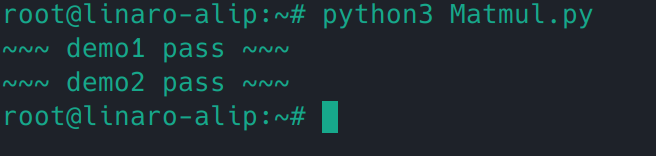

---


## 5

补零是不必要的，因为补零的位置虽然会被运算，但是并不会作为“有效答案”。

如果不进行补 0，无效位置保留默认值，不会影响矩阵运算结果，这是因为我们通过控制信号，会忽略原先补零位置计算出的答案。

我们可以将“补零”操作改为“补一”操作验证上面的观点，修改 `Matmul.py`  中的 `send_data` 方法

```python
# 原为 padd = np.zeros((self.paddedm, n), dtype=np.uint8)
padd = np.ones((self.paddedm, n), dtype=np.uint8)
```

然后运行工程，会发现依然是可以正常工作的，效果如图

 

----


## 6

如果需要“跳地址”，那么就需要人为控制写入的偏移量，可以通过修改 `bram.py` 文件，来为偏移量增设这个功能。然后修改 `Matmul.py` 文件，使得我们可以在传输数据的时候实现“跳地址”的功能。

```python
### bram.py
def write(self, data, block_name: str, offset='default'):
    '''写入数据
        由于数据位宽32bit，因此最好以4的倍数Byte写入(还不知道以1Byte单位写进去会有什么效果)

        Args：
            data: 输入的数据
            block_name: BramConfig中配置的block_info的key值
            offset: BramConfig中配置的offset字典key值
    '''
    map_ = self.block_map[block_name]

    if isinstance(offset, str):
        offset_ = self.block_info[block_name]['offset'][offset]
    # 这里增加一种新的方式给出偏移量
    else:
        offset_ = offset
    
    map_.seek(offset_)
    if isinstance(data, np.ndarray):
        data = data.reshape(-1)
    map_.write(data)

### Matmul.py
def send_data(self, data, block_name, offset='default'):
    padd = 0
    r, c = 0, 0
    if block_name == 'input':
        # M x N
        m, n = data.shape
        self.ori_m = m
        padd = self.systolic_size * (m // self.systolic_size + 1) - m
        # padd = np.zeros((self.paddedm, n), dtype=np.uint8)
        # padded = np.append(data, padd, axis=0).T
        self.paddedm = m + padd
        toWrite = data.T
        r, c = n, self.paddedm
    else:
        assert block_name == 'weight'
        # N x P
        n, p = data.shape
       self.ori_p = p
        padd = self.systolic_size * (p // self.systolic_size + 1) - p
        # padd = np.zeros((n, self.paddedp), dtype=np.int8)
        # padded = np.append(data, padd, axis=1)
        self.paddedp = p + padd
        toWrite = data
        r, c = n, self.paddedp
    self.n = n
    # 将内存中的顺序调整为行优先
    toWrite = toWrite.copy(order='C')
    for i in range(r):
        # 手动控制偏移量
        self.bram.write(toWrite[i, :], block_name=block_name, offset=i * c)
    # self.bram.write(padded, block_name=block_name)
    # pass
```

需要注意的是，可能是由于前面出现了“转置”操作，所以如果直接书写代码，会报错

```shell
not C-contiguous
```

意思是 `ndarray` 在内存中的存储方式不是行优先（C-order）的。而Fortrant-order（列优先顺序）不适合 `mmap` 的写入。所以我们需要将数组重新变成行优先序，即如下代码：

```python
toWrite = toWrite.copy(order='C')
```

---


## 7

是 $\tt{125.000000 MHz}$ 。

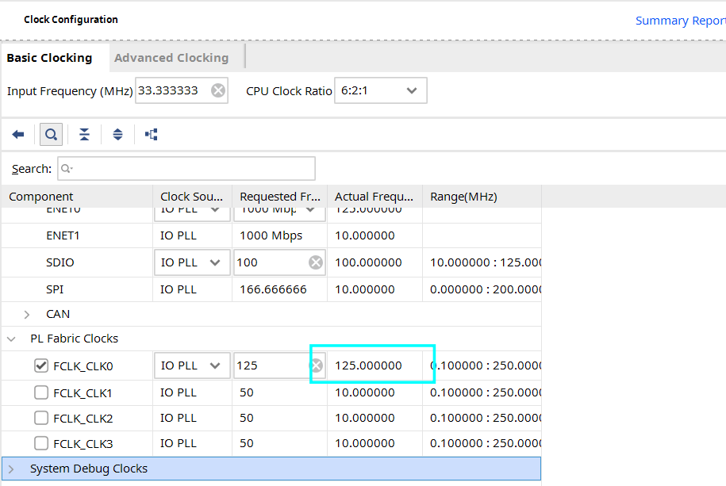


## 8

结合以下源码和指导书可以画出状态转移图：

```Verilog
localparam IDLE   = 5'b0_0001;
localparam INFO   = 5'b0_0010;
localparam WORK   = 5'b0_0100;
localparam WAIT   = 5'b0_1000;
localparam FINISH = 5'b1_0000;

// 当前状态
reg [4:0] c_state;
// 下一状态
reg [4:0] n_state;

// 很简单的状态机
always @(posedge clk or posedge rst) begin
    if (rst) begin
        c_state <= IDLE;
    end
    else begin
        c_state <= n_state;
    end
end

always @(*) begin
    case(c_state)
    IDLE: begin
        // 运算开始
        if (submulti_start)
            n_state = INFO;
        else
            n_state = c_state;
    end
    INFO: begin
        n_state = WORK;
    end
    WORK: begin
        // 应该是数据搬运完了的意思
        if (N_cnt == N - 1'b1)
            n_state = WAIT;
        else
            n_state = c_state;
    end
    WAIT: begin
        // 坍塌运算，应该是 align_fifo_get_all 都弄完了
        if (&align_fifo_get_all)
            n_state = FINISH;
        else
            n_state = c_state;
    end
    // 重新回到空闲状态
    FINISH: begin
        n_state = IDLE;
    end
    default: n_state = IDLE;
    endcase
end
```

状态图：

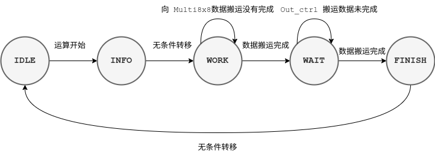


寄存器功能如下表所示

| 寄存器       | 功能                                                         |
| ------------ | ------------------------------------------------------------ |
| sub_scale_M1 | 第 1 个矩阵乘法单元，结果矩阵的行数，输出给 Align_fifo，用于控制答案矩阵的有效值 |
| sub_scale_P1 | 第 1 个矩阵乘法单元，结果矩阵的列数，输出给 Align_fifo，用于控制答案矩阵的有效值 |
| sub_scale_M2 | 第 2 个矩阵乘法单元，结果矩阵的行数，输出给 Align_fifo，用于控制答案矩阵的有效值 |
| sub_scale_P2 | 第 2 个矩阵乘法单元，结果矩阵的列数，输出给 Align_fifo，用于控制答案矩阵的有效值 |

---


## 9

Align_fifo 模块内结构如图所示

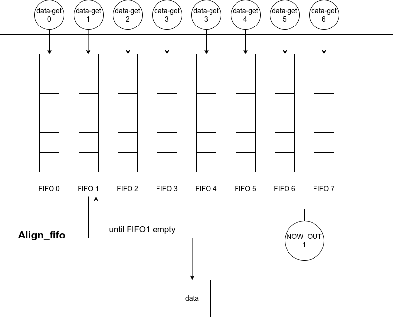

也就是说，Align_fifo 内部有 8 个 FIFO IP 核，用于存储 Multi_8x8 的输出。

### 9.1 读过程

从代码中可以看出，读过程是并行执行的，只是需要受到检验是否入队（因为对于有些数据是无效的），代码如图

```verilog
// 检验是否入队，要满足没有被读出，该位有效，还没有写完等条件
assign fifo_wr_en[0] = (~align_fifo_get_all)&&valid_get0&&(sub_scale_P>8'd0)&&(fifo_wr_cnt[0]<sub_scale_M);
assign fifo_wr_en[1] = (~align_fifo_get_all)&&valid_get1&&(sub_scale_P>8'd1)&&(fifo_wr_cnt[1]<sub_scale_M);
assign fifo_wr_en[2] = (~align_fifo_get_all)&&valid_get2&&(sub_scale_P>8'd2)&&(fifo_wr_cnt[2]<sub_scale_M);
assign fifo_wr_en[3] = (~align_fifo_get_all)&&valid_get3&&(sub_scale_P>8'd3)&&(fifo_wr_cnt[3]<sub_scale_M);
assign fifo_wr_en[4] = (~align_fifo_get_all)&&valid_get4&&(sub_scale_P>8'd4)&&(fifo_wr_cnt[4]<sub_scale_M);
assign fifo_wr_en[5] = (~align_fifo_get_all)&&valid_get5&&(sub_scale_P>8'd5)&&(fifo_wr_cnt[5]<sub_scale_M);
assign fifo_wr_en[6] = (~align_fifo_get_all)&&valid_get6&&(sub_scale_P>8'd6)&&(fifo_wr_cnt[6]<sub_scale_M);
assign fifo_wr_en[7] = (~align_fifo_get_all)&&valid_get7&&(sub_scale_P>8'd7)&&(fifo_wr_cnt[7]<sub_scale_M);

// 写入数据
assign fifo_din[0] = data_get0;
assign fifo_din[1] = data_get1;
assign fifo_din[2] = data_get2;
assign fifo_din[3] = data_get3;
assign fifo_din[4] = data_get4;
assign fifo_din[5] = data_get5;
assign fifo_din[6] = data_get6;
assign fifo_din[7] = data_get7;
```

仿真如图

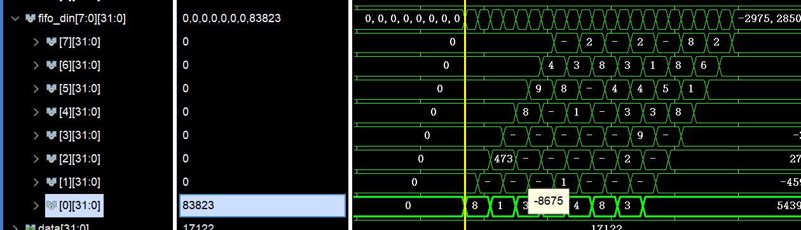

### 9.2 写过程

写过程是一个串行过程，这可能是因为写入 BRAM_32 的时候是串行的，所以没必要在这里并行。相关代码如图

```verilog
// 状态转换，根据 fifo_rd_en 进行转换
always @(*) begin
    case (c_state)
    NOW_OUT0: begin
        if (fifo_rd_en[0]&&(sub_scale_P==8'd1))
            n_state = NOW_OUT0;
        else if (fifo_rd_en[0])
            n_state = NOW_OUT1;
        else
            n_state = c_state;
    end
    NOW_OUT1: begin
        if (fifo_rd_en[1]&&(sub_scale_P==8'd2))
            n_state = NOW_OUT0;
        else if (fifo_rd_en[1])
            n_state = NOW_OUT2;
        else
            n_state = c_state;
    end
    NOW_OUT2: begin
        if (fifo_rd_en[2]&&(sub_scale_P==8'd3))
            n_state = NOW_OUT0;
        else if (fifo_rd_en[2])
            n_state = NOW_OUT3;
        else
            n_state = c_state;
    end
    NOW_OUT3: begin
        if (fifo_rd_en[3]&&(sub_scale_P==8'd4))
            n_state = NOW_OUT0;
        else if (fifo_rd_en[3])
            n_state = NOW_OUT4;
        else
            n_state = c_state;
    end
    NOW_OUT4: begin
        if (fifo_rd_en[4]&&(sub_scale_P==8'd5))
            n_state = NOW_OUT0;
        else if (fifo_rd_en[4])
            n_state = NOW_OUT5;
        else
            n_state = c_state;
    end
    NOW_OUT5: begin
        if (fifo_rd_en[5]&&(sub_scale_P==8'd6))
            n_state = NOW_OUT0;
        else if (fifo_rd_en[5])
            n_state = NOW_OUT6;
        else
            n_state = c_state;
    end
    NOW_OUT6: begin
        if (fifo_rd_en[6]&&(sub_scale_P==8'd7))
            n_state = NOW_OUT0;
        else if (fifo_rd_en[6])
            n_state = NOW_OUT7;
        else
            n_state = c_state;
    end
    NOW_OUT7: begin
        if (fifo_rd_en[7]&&(sub_scale_P==8'd8))
            n_state = NOW_OUT0;
        else if (fifo_rd_en[7])
            n_state = NOW_OUT0;
        else
            n_state = c_state;
    end
    default: n_state = NOW_OUT0;
    endcase
end

// ready 转换条件，只有当当前队列为空且 out_ctrl 完成的时候，才可以进行状态转换
always @(*) begin
    fifo_rd_en = 8'b0;
    case (c_state)
    NOW_OUT0: fifo_rd_en[0] = (~fifo_empty[0])&out_ctrl_ready;
    NOW_OUT1: fifo_rd_en[1] = (~fifo_empty[1])&out_ctrl_ready;
    NOW_OUT2: fifo_rd_en[2] = (~fifo_empty[2])&out_ctrl_ready;
    NOW_OUT3: fifo_rd_en[3] = (~fifo_empty[3])&out_ctrl_ready;
    NOW_OUT4: fifo_rd_en[4] = (~fifo_empty[4])&out_ctrl_ready;
    NOW_OUT5: fifo_rd_en[5] = (~fifo_empty[5])&out_ctrl_ready;
    NOW_OUT6: fifo_rd_en[6] = (~fifo_empty[6])&out_ctrl_ready;
    NOW_OUT7: fifo_rd_en[7] = (~fifo_empty[7])&out_ctrl_ready;
    default: fifo_rd_en = 8'b0;
    endcase
end
// 根据状态，选择输出数据
always @(*) begin
    case (c_state_f1)
    NOW_OUT0: data = fifo_dout[0];
    NOW_OUT1: data = fifo_dout[1];
    NOW_OUT2: data = fifo_dout[2];
    NOW_OUT3: data = fifo_dout[3];
    NOW_OUT4: data = fifo_dout[4];
    NOW_OUT5: data = fifo_dout[5];
    NOW_OUT6: data = fifo_dout[6];
    NOW_OUT7: data = fifo_dout[7];
    default: data = 'b0;
    endcase
end
```

读出的时候，是一个队列一个队列的读出，最终完成串行化。

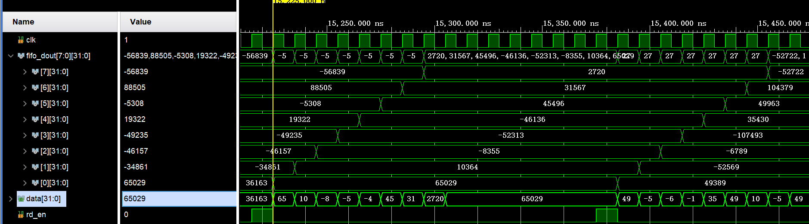

---


## 10

### 10.1 削减 MAC 资源

原工程中为了确定有效数据，提供了很多的信号位（`w_valid` 和 `f_valid` 信号，对于全局还有一个 `num_valid`）来进行确定，但是各个信号之间的功能是有重叠部分的，也就是有冗余现象的出现。

可以考虑只使用一个 `num_valid` 信号完成对于“有效”的控制，它充当一个类似 reset 信号的功能，重置乘加器内部的寄存器，设置内部的num_r寄存器为输入的num_r值。当输入数据有效时，再拉低num_valid信号，乘加器自动开始计数，在指定周期内完成乘法的运算要求。

在整个矩阵乘法整列中，将外部的 `num_valid` 信号只接入左上角的第一个乘加模块，后续模块的 `num_valid` 信号接入左侧或者上方乘加模块的 `num_valid_r` 输出，且保证最终所有模块在同一个连接图内，即可。这样可以节约乘法器的四组输入与三组输出，有利于减少最终使用的资源。由于这样的整列会重复 64 次，这些细节的节约，对最终是会有比较大的影响的。

### 10.2 提高乘法器吞吐量

原始设计中，矩阵乘法的运算是多周期的。下一次矩阵乘法运算会等待上一次运算的结果存好后再开始下一次运算。如果考虑流水线化的设计，并不需要等待上一次的计算完全完成，可以在乘法模块上并行运行两次运算，但是这就需要对与输入输出有架构性的调整。

### 10.3 具体实现

具体实现和详细文档请看 $yofingert$ 的作业。

