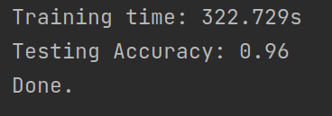

## 一、感受

​    真的是十分开心的，毕竟自己终于搭建了一个“神经网络”，其成就感，简直和自己第一次写 Hello, world. ，第一次写字典树，第一次写出流水线 CPU，第一次在 ARM 上移植操作系统，第一次写出编译器后端一样快乐。当我的电脑的 CPU 利用率被这个东西拉满，风扇开始轰鸣的时候，开心的都要冒泡了。


​    尤其是“人工智能”这个词，在甚嚣尘上的舆论聚光灯下，已经被蒙上了一种虚妄的光晕。我回老家的时候，被问道“你会修电脑吗？”和“我会人工智能，你会吗？”的次数是一样多的。最尴尬的是，我明知道我学的东西或许并不比一个简单的神经网络浅薄，但是还是会因为自己不懂人工智能而自卑，因“外行人抢夺话语权”而闷闷不乐。转而我又会想到自己不够自信，不够有涵养，不够包容，进而跟自己更加生气。

​    虽然这次严格意义上讲，也并不是纯粹的手搓，老师是给了示例代码的。我的工作不过是修改一些地方，就可以满足实验的要求了。不过通过梳理代码，看到线代知识，高数知识，编程知识，数学建模知识交织在一起，也是一件很有意思的事情。这种乐趣，我觉得比上面那种“战胜自卑”的乐趣更加纯粹。

---

## 二、概述

​    这次的实验要求是利用已有的三层神经网络，改成一个四层的神经网络，最终实现一个手写数字识别的功能。其中修改的任务确实不是很难，基本上利用找规律和矩阵乘法的合法性就可以推断出如何多加一个 hidden layer 。

​    所以我的精力主要放在了两个部分，一个是对于神经网络的数学原理的解释上，一个是对于原有代码的改写上（虽然只是一些小面积改写）。我之后会着重与这两个方面展开介绍。

---

## 三、效果

​    具体的调参记录在第五节有叙述，这里只讨论效果最好的一次的参数配置。



配置为：

- 层数：4
  
- 学习率：0.08
  
- 中间节点个数：600
  
- 迭代次数：2
  
​    由 `input` 到 `hidden1`  的权重保存在 `./weights/wih1.npy` 文件中，由 `hidden1` 到 `hidden2` 的权重保存在 `./weights/wh1h2.npy` 中，由 `hidden2`  到 `outupt` 的权重保存在 `./weights/wh2o.npy` 。

----

## 四、原理

### 4.1 numpy

`numpy` 库里面东西很多，我们主要用到里面线性代数的部分。比如说

```python
np.random.normal(loc, scale, size)
```

可以生成一个正态分布的矩阵。

```
np.array(input_feature, ndmin=2).T
```

可以用于生成一个二维矩阵，注意在 `numpy` 的概念里，矩阵和向量是两个概念。2 维向量和 $2 \times 1$ 的矩阵并不相同，对于向量，可以用到的操作是很少的（可能就是为了避免泛型 `List` 吧）。

此外，`numpy` 还重载了一堆运算符，比如说 `*` 对于两个同维度矩阵来说，就是对应元素相乘，对于标量与矩阵，就是标量乘上矩阵的每个元素，对于 `@` ，就是矩阵点乘。加减法类似。

除此之外，`numpy` 还提供了一些与文件的交互接口，比如说 `numpy` 可以读取一个二进制文件到一个 `numpy` 数组中，我们利用这个接口读取训练集和测试集。

```python
labels = np.fromfile(l_path, dtype=np.uint8)
```

也可以将一个数组中的结果保存到文件中，我们用它来保存权重

```python
np.save('./weights/wih1.npy', model.input_hidden1_weight)
```

### 4.2 前向

​    基础的理解在另一篇博客中 https://thysrael.github.io/posts/963bfa61/ 介绍了，这里主要介绍一下具体的表现形式
$$

N_{m \times 1} = W_{m \times n} \bullet I_{n \times 1} \\

O_{m \times 1} = f(N_{m \times 1})

$$

​    这个东西描述了**一层**神经网络的结构，这一层的神经网络具有 n 个输入，具有 m 个输出。我们通过权重矩阵将输入映射到 m 维，对应的过程是 m 个神经元收集输入信息引发电位变化的过程，其中 $W$ 矩阵的每一行都代表一个神经元的权重。$f$ 被称为 `activation function` ，他接受一个 m 维的向量，输出一个 m 维的向量，对应的是局部电位引发动作电位的过程。

### 4.3 反向传播

​    其基本原理很好理解，对于每一层，我们都可以逆序依次计算（从输出到输入）每一层的误差，然后每一层根据该层的误差，调整自己的参数，调整的方法为**梯度下降法**，简单说就是如果一个权重对于最后的误差影响大，那么就调整他调整的比较大，我们衡量的方法就是看他的梯度。

​    首先我们看如何计算每层的误差

```python
# output layer error is the (target - actual)
output_loss = targets - self.final_outputs
# hidden layer2 error is the output_errors, split by weights, recombined at hidden nodes
hidden2_loss = self.hidden2_output_weight.T @ output_loss
# hidden layer1 error is the hidden2_errors, split by weights, recombined at hidden nodes
hidden1_loss = self.hidden1_hidden2_weight.T @ hidden2_loss
```

​    可以看到输出层的误差就是理论结果与实际结果的差值，很好理解，对于倒数第一隐层的误差，就是权重矩阵的转置与输出误差的点乘。虽然这样有些道理，但是没有考虑激励函数，可以认为是一种神奇的建模思想吧，即
$$
E^{'}_{(n \times 1)} = W^{T}_{m\times n} E_{m\times 1}
$$
​    跟之前的前项传播放在一起
$$
N_{m \times 1} = W_{m \times n} \bullet I_{n \times 1}
$$
​    可以看出还是有一些道理的。

​    然后开始介绍梯度下降法，这里面会涉及一些神秘公式，希望以后我还能记得，首先是总公式

E^{'}_{(n \times 1)} = W^{T}_{m\times n} E_{m\times 1}

$$

​    跟之前的前项传播放在一起

$$

N_{m \times 1} = W_{m \times n} \bullet I_{n \times 1}

$$

​    可以看出还是有一些道理的。

​    然后开始介绍梯度下降法，这里面会涉及一些神秘公式，希望以后我还能记得，首先是总公式

$$

W^{'} = W - learn\_rate \times \frac{dE_s}{dW}

$$
​    其中重点可以引用链式法则拆解
$$

\frac{dE_s}{dW} = \frac{dE_s}{dO}\times \frac{dO}{dN} \times \frac{dN}{dW}

$$
​    其中有
$$

E_s = \sum_{i}^{m} (target_i - O_i)^2

$$
​    所以有
$$

\frac{dE_s}{dO} = E_{m\times1}

$$
​    对于 $\frac{dO}{dN}$ ，本质是对激励函数的求导，我们采用的激励函数是 $f(x) = \frac{1}{1 - e^{-x}}$ ，有奇妙特性为 $f^{'}(x) = f(x)(1 - f(x))$。所以有
$$

\frac{dO}{dN} = O_{m\times1}(1_{m\times1} - O_{m\times1})

$$
​    对于最后一个部分，有
$$

\frac{dN}{dW} = I_{1\times n}

$$
​    最终有代码

```python
self.hidden2_output_weight += \
            self.learning_rate * \
            (output_loss * self.final_outputs * (1.0 - self.final_outputs)) @ self.hidden2_outputs.T
```

​    当然很多东西并不那么数学。

----

## 五、调参

​    主要的参数是有三个，一个是学习率 `learn rate`，一个是中间节点个数 `hidden_nodes`，一个是迭代次数 `epoches`

​    很容易分析得知，当学习率变高的时候，误差对于权重改变的影响会更加大。不过如果学习率变得过高，会出现某种意义上的过拟合现象，即一次较大误差可能会破坏原有的训练成果，表现为错误率呈现出剧烈的震荡，而且还始终维持较高水平。相反的，较低的学习率则更加“精密”，通过增大其他参数，可以让学习率降低，来达到更好的效果。

​    中间节点个数似乎是越多越好的，这个是我一个 21 系的舍友告诉我的，我自己理性分析也是这样的，毕竟多了总比少了好，“异质”总比“同质”好。而且确实效果也是这样的，当我把节点数提高到 400 个的时候，准确率会上升两个百分点，但是似乎继续提高，边际收益会减少，比如说当我把节点提高到 800 个的时候，准确度基本上只提高了半个百分点。但是计算所用的时间会非线性的增长。

​    迭代次数并不会在 `NeuralNetwork` 这个类中可以调整，而是在 `main.py` 中的函数 `train` 函数中的局部变量 `epoches` 中可调，原有代码是 2 次，显然增大次数会让准确率提高（应该吧，可能会有过拟合现象）。我一开始并没有发现这个变量，所以一直没调，之后补录，大概缺少了一些数据。

​    其实还有一个变量是 hidden layer 的层数，我也不知道为啥 4 层的效果没有 3 层的好。我个人觉得，官方提供的代码可能参数已经调好了，而这些参数并不适应 4 层的网络，所以导致直接跑效果并不太好。

​    最终数据如下

| 层数  | 学习率  | 中间节点个数 | 迭代次数 | 准确率 |
| --- | ---- | ------ | ---- | --- |
| 3   | 0.1  | 200    | 2    | 97% |
| 4   | 0.1  | 200    | 2    | 95% |
| 4   | 0.1  | 400    | 2    | 96% |
| 4   | 0.08 | 600    | 2    | 97% |
| 4   | 0.2  | 200    | 2    | 82% |
| 4   | 0.05 | 300    | 4    | 97% |

