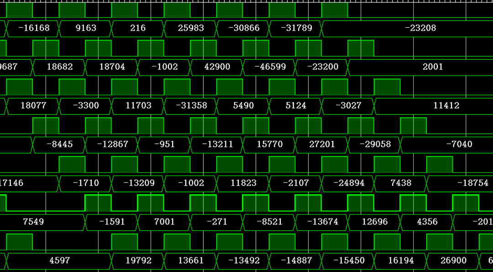
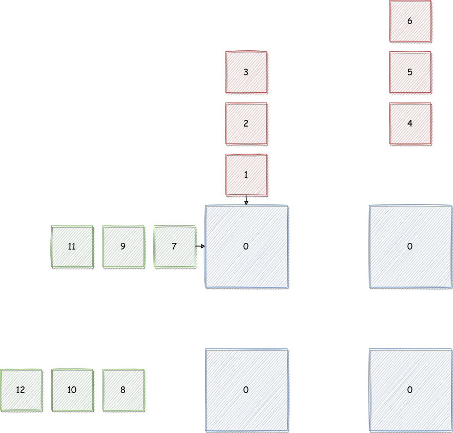
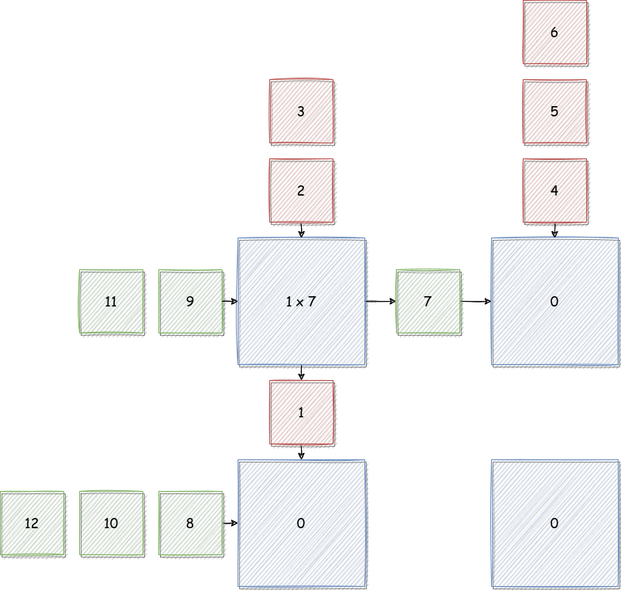
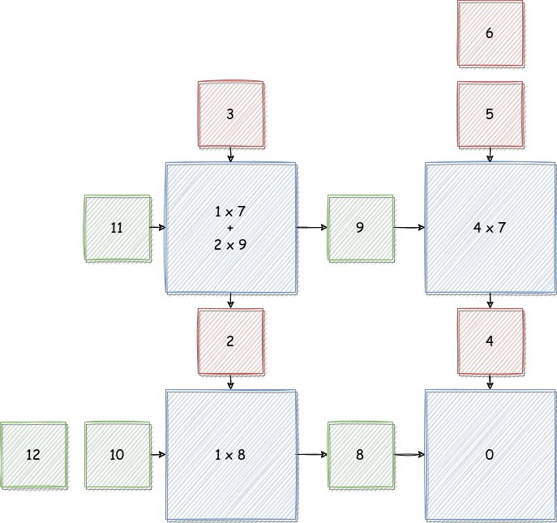
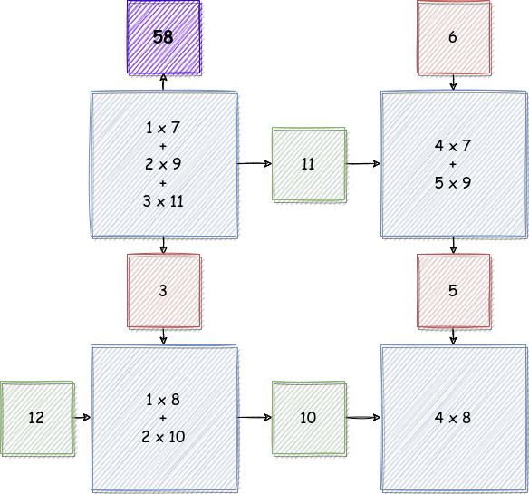
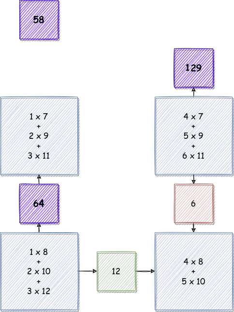
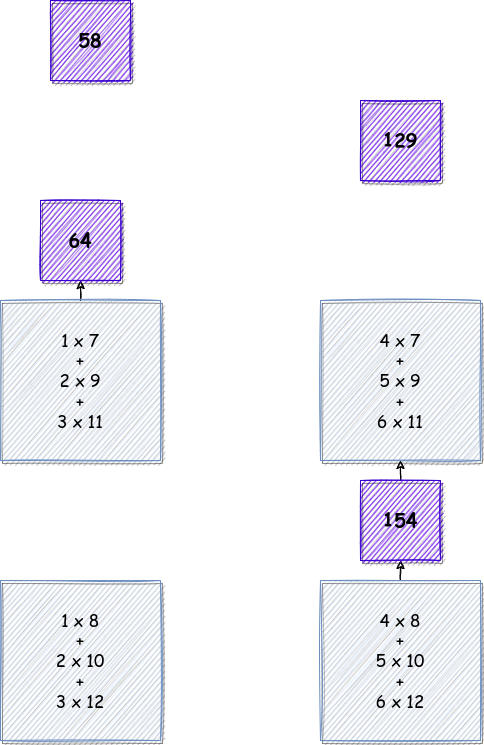
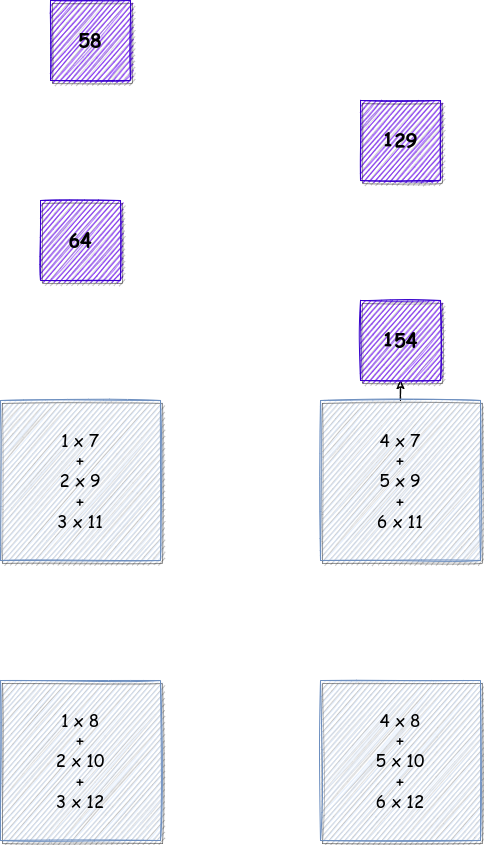
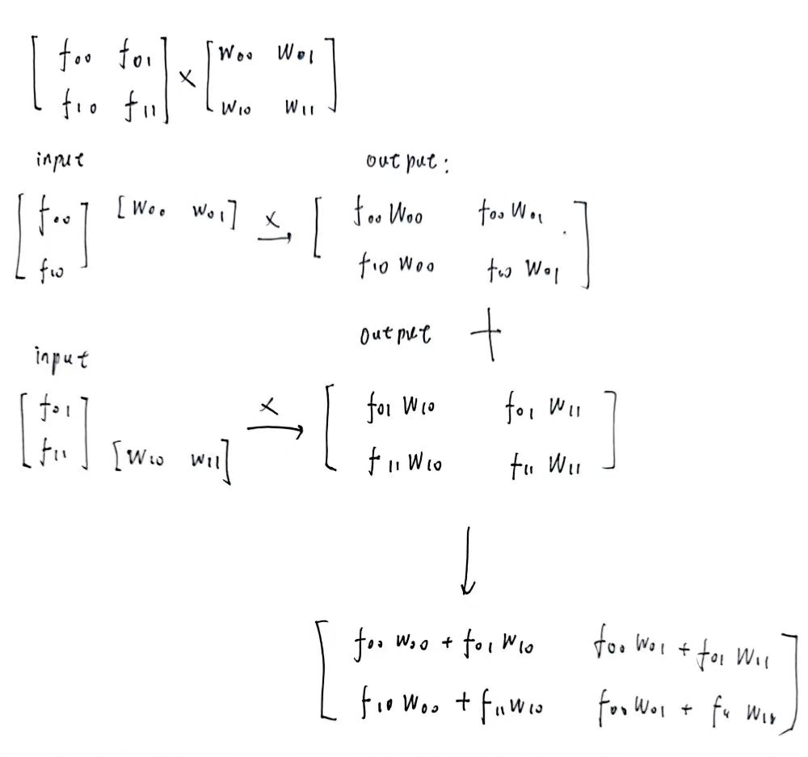
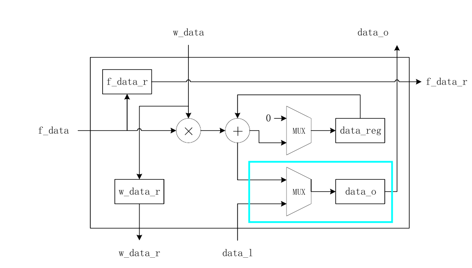

## 一、思考题

> 回答 4.1.5 疑问中的疑问,
>
> 问题 1 —— 第二个矩阵计算为何出错,
>
> 问题 2 —— MAC.v 是否有修改的必要

### 1.1 问题 1

第一个矩阵出错的原因是在第二个矩阵计算中，在第一个矩阵中涉及到了负数

```python
[[ 111,   25,   32,   66,  -12,  -99,  -28,   16,  -95],
[  63,  -90, -102,   40,   73,   16,  -53,  -33,  -27],
[ -39,  -79,  -12,  -83, -112,   59,   34,  -49,  -57],
[ -18,  103,  -86,  -51, -104,   36, -105,  112,   58],
[  52,  -12,  -52,    1,  -95, -123,   34,  -89,   11],
[  50,  123,   90,  -74,   99,  100,   95,  -12,  -97],
[  12,  -94,   55,  -14,  115,   84, -110,   64,   18],
[  74, -105, -111,  -43,   63,  107,  111,   56,  -15]]
```

而在 `MAC.v` 代码中，对于乘法的计算，是这样的

```verilog
wire signed [15:0] sf_data;
assign sf_data = $signed({8'b0, f_data});
// 本级计算
reg signed [31:0] data_reg;  // 存储乘累加的结果
always @(posedge clk or posedge rst) begin
    // 复位清零
    if (rst) begin
        data_reg <= 32'b0;
    end
    // 如果 valid
    else if (valid) begin
        // 到了最后一次计算的时候，就交给输出计算，自己复位
        if (last) begin
            data_reg <= 32'b0;
        end
        // 进行一个乘累加操作
        else begin
            data_reg <= data_reg + $signed(w_data) * $signed(sf_data);
        end
    end
    // 保持原值不变
    else begin
        data_reg <= data_reg;
    end
end
```

因为 8 位的操作数乘法运算，可能出现 16 位的结果，而零拓展只适用于无符号乘法，而第二个矩阵中出现的第一个矩阵中出现了负数，这就导致了运算错误的出现。只需要将其修改如下

```verilog
assign sf_data = $signed( {{8{f_data[7]}}, f_data});    // 修改后
assign sf_data = $signed({8'b0, f_data});                // 修改前
```

那么就可以有 `test.py` 中的输出结果，如图所示



### 1.1 问题 2

```
没有必要修改，因为根据题义描述，这个模块将被用于全连接层，其输入格式是
```

```
feature 是 uint8,weight 是 int8
```

```
全连接层的计算方式为
```

$F \cdot W$ 。从上面的分析可以看出，这个模块未修改前对于 $W$ 中的负数分量就可以正确处理，只是没有办法处理 $F$ 中的负数分量，但是由输入格式可知，$F$ 的分量是 `uint8`，其范围是 `0 ~ 255` 所以不会出现负数情况，所以是没有必要修改的。

---

## 二、矩阵乘模块设计文档

### 2.1 设计功能

```
对于
```

`Multiply_8x8` 模块，它接受一个 `8 x num` 的分量为 `uint8` 的 $Feature$ 矩阵和一个 `num x 8` 的分量为 `int` 的 $Weight$ 矩阵，在经过一定的周期后输出 $Feature \cdot Weight$ 。

```
对于
```

`MAC` 模块，它将输入的 `uint8` 的值和 `int8` 的值相乘，并与保存在寄存器中的值进行加和，然后将结果继续保存在这个寄存器中。除了计算功能以外，`MAC` 还有传递输入数据和传递计算结果的功能。

### 2.2 接口说明

对于 `Multiply_8x8`  模块有

| 名称          | 位宽 | 符号     | 方向   | 含义                                              |
| ------------- | ---- | -------- | ------ | ------------------------------------------------- |
| clk           | 1    | unsigned | input  | 时钟信号                                          |
| rst           | 1    | unsigned | input  | 复位信号                                          |
| fvalid0       | 1    | unsigned | input  | $F$ 矩阵的第 0 行输入是否有效                   |
| fdata0        | 8    | unsigned | input  | $F$ 矩阵的第 0 行输入数据                       |
| fvalid1       | 1    | unsigned | input  | $F$ 矩阵的第 1 行输入是否有效                   |
| fdata1        | 8    | unsigned | input  | $F$ 矩阵的第 1 行输入数据                       |
| fvalid2       | 1    | unsigned | input  | $F$ 矩阵的第 2 行输入是否有效                   |
| fdata2        | 8    | unsigned | input  | $F$ 矩阵的第 2 行输入数据                       |
| fvalid3       | 1    | unsigned | input  | $F$ 矩阵的第 3 行输入是否有效                   |
| fdata3        | 8    | unsigned | input  | $F$ 矩阵的第 3 行输入数据                       |
| fvalid4       | 1    | unsigned | input  | $F$ 矩阵的第 4 行输入是否有效                   |
| fdata4        | 8    | unsigned | input  | $F$ 矩阵的第 4 行输入数据                       |
| fvalid5       | 1    | unsigned | input  | $F$ 矩阵的第 5 行输入是否有效                   |
| fdata5        | 8    | unsigned | input  | $F$ 矩阵的第 5 行输入数据                       |
| fvalid6       | 1    | unsigned | input  | $F$ 矩阵的第 6 行输入是否有效                   |
| fdata6        | 8    | unsigned | input  | $F$ 矩阵的第 6 行输入数据                       |
| fvalid7       | 1    | unsigned | input  | $F$ 矩阵的第 7 行输入是否有效                   |
| fdata7        | 8    | unsigned | input  | $F$ 矩阵的第 7 行输入数据                       |
| wvalid0       | 1    | unsigned | input  | $W$ 矩阵的第 0 列输入是否有效                   |
| wdata0        | 8    | signed   | input  | $W$ 矩阵的第 0 列输入数据                       |
| wvalid1       | 1    | unsigned | input  | $W$ 矩阵的第 1 列输入是否有效                   |
| wdata1        | 8    | signed   | input  | $W$ 矩阵的第 1 列输入数据                       |
| wvalid2       | 1    | unsigned | input  | $W$ 矩阵的第 2 列输入是否有效                   |
| wdata2        | 8    | signed   | input  | $W$ 矩阵的第 2 列输入数据                       |
| wvalid3       | 1    | unsigned | input  | $W$ 矩阵的第 3 列输入是否有效                   |
| wdata3        | 8    | signed   | input  | $W$ 矩阵的第 3 列输入数据                       |
| wvalid4       | 1    | unsigned | input  | $W$ 矩阵的第 4 列输入是否有效                   |
| wdata4        | 8    | signed   | input  | $W$ 矩阵的第 4 列输入数据                       |
| wvalid5       | 1    | unsigned | input  | $W$ 矩阵的第 5 列输入是否有效                   |
| wdata5        | 8    | signed   | input  | $W$ 矩阵的第 5 列输入数据                       |
| wvalid6       | 1    | unsigned | input  | $W$ 矩阵的第 6 列输入是否有效                   |
| wdata6        | 8    | signed   | input  | $W$ 矩阵的第 6 列输入数据                       |
| wvalid7       | 1    | unsigned | input  | $W$ 矩阵的第 7 列输入是否有效                   |
| wdata7        | 8    | signed   | input  | $W$ 矩阵的第 7 列输入数据                       |
| num_valid_ori | 1    | unsigned | input  | $W$ 矩阵的列数（同时也是 $F$ 的行数）是否有效 |
| num_ori       | 32   | unsigned | input  | $W$ 矩阵的列数（同时也是 $F$ 的行数）         |
| valid_o0      | 1    | unsigned | output | 结果矩阵的第 0 行是否有效                         |
| data_o0       | 32   | signed   | output | 结果矩阵的第 0 行输出数据                         |
| valid_o1      | 1    | unsigned | output | 结果矩阵的第 1 行是否有效                         |
| data_o1       | 32   | signed   | output | 结果矩阵的第 1 行输出数据                         |
| valid_o2      | 1    | unsigned | output | 结果矩阵的第 2 行是否有效                         |
| data_o2       | 32   | signed   | output | 结果矩阵的第 2 行输出数据                         |
| valid_o3      | 1    | unsigned | output | 结果矩阵的第 3 行是否有效                         |
| data_o3       | 32   | signed   | output | 结果矩阵的第 3 行输出数据                         |
| valid_o4      | 1    | unsigned | output | 结果矩阵的第 4 行是否有效                         |
| data_o4       | 32   | signed   | output | 结果矩阵的第 4 行输出数据                         |
| valid_o5      | 1    | unsigned | output | 结果矩阵的第 5 行是否有效                         |
| data_o5       | 32   | signed   | output | 结果矩阵的第 5 行输出数据                         |
| valid_o6      | 1    | unsigned | output | 结果矩阵的第 6 行是否有效                         |
| data_o6       | 32   | signed   | output | 结果矩阵的第 6 行输出数据                         |
| valid_o7      | 1    | unsigned | output | 结果矩阵的第 7 行是否有效                         |
| data_o7       | 32   | signed   | output | 结果矩阵的第 7 行输出数据                         |

对于 `MAC` 模块，有

| 名称        | 位宽 | 符号     | 方向   | 含义                                          |
| ----------- | ---- | -------- | ------ | --------------------------------------------- |
| clk         | 1    | unsigned | input  | 时钟信号                                      |
| rst         | 1    | unsigned | input  | 复位信号                                      |
| num_valid   | 1    | unsigned | input  | 乘累加长度 `num` 是否有效                   |
| num         | 32   | unsigned | input  | 乘累加长度                                    |
| num_r_valid | 1    | unsigned | output | 传播到下一 MAC 的乘累加长度是否有效           |
| num_r       | 32   | unsigned | output | 传播到下一 MAC 的乘累加长度                   |
| w_valid     | 1    | unsigned | input  | $W$ 矩阵的一个分量是否有效                  |
| w           | 8    | signed   | input  | $W$ 矩阵的一个分量                          |
| w_r_valid   | 1    | unsigned | output | 传播到下一 MAC 的$W$ 矩阵的一个分量是否有效 |
| w_r         | 8    | signed   | output | 传播到下一 MAC 的$W$ 矩阵的一个分量长度     |
| f_valid     | 1    | unsigned | input  | $F$ 矩阵的一个分量是否有效                  |
| f           | 8    | unsigned | input  | $F$ 矩阵的一个分量                          |
| f_r_valid   | 1    | unsigned | output | 传播到下一 MAC 的$F$ 矩阵的一个分量是否有效 |
| f_r         | 8    | unsigned | output | 传播到下一 MAC 的$F$ 矩阵的一个分量长度     |
| valid_l     | 1    | unsigned | input  | 下一个 MAC 的运算结果是否有效                 |
| data_l      | 32   | signed   | input  | 下一个 MAC 的运算结果                         |
| valid_o     | 1    | unsigned | output | 该 MAC 的运算结果是否有效                     |
| data_o      | 32   | signed   | output | 该 MAC 的运算结果                             |

### 2.3 设计思想及流程描述

```
为了更好的展示设计思想和流程，这里采用一个简化版的矩阵乘法，比较方便描述。
```

```
流程主要分为两个部分，一个是计算，一个是将结果传出。
```

#### 2.3.1 简单流程模拟

```
我们规定我们的需求是计算
```

$$
F_{2 \times 3} \cdot W_{3 \times 2} = R_{2\times 2}
$$

```
其中有
```

$$
F = \left[
\begin{matrix}
1 & 2 & 3 \\
4 & 5 & 6
\end{matrix}
\right]
\quad\quad
W = \left[
\begin{matrix}
7 & 8 \\
9 & 10\\
11 & 12
\end{matrix}
\right]
$$

```
此时我们只需要一个
```

`2 x 2` 个 `MAC` 即可完成运算，如下所示

**Cycle 0**



首先数据呈现这这种形式

**Cycle 1**



**Cycle 2**



**Cycle 3**



**Cycle 4**



**Cycle 5**



**Cycle 6**



对于这样的一个计算，需要花

$$
2 + 3 + 2 = 7
$$

个周期就可以得到结果。

#### 2.3.2 设计思想

```
对于矩阵乘法，可以看做是一堆数进行
```

**有规律、有复用的乘加运算**，所以搭建模块解决这个问题，需要将其按照规律一步一步的进行计算。普世分析

$$
A_{p \times n} \cdot B_{n \times q} = R_{p \times q}
$$

```
对于 MAC 模块，它对应这结果矩阵
```

$R$ 中的一个分量，为了计算这个分量，需要进行 `n` 次的乘并累加操作。所以一般是在 `n` 个周期内完成的。需要注意的是，对于 $A, B$ 中的某个分量，不止会被一个 MAC 利用，所以 MAC 还承担着传播分量的作用，除此之外，MAC 计算出结果后，还需要将结果通过 MAC 网络传递出去。

```
那么又没有什么更快的改进方法呢，其实是有的，比如说下面这种方法，就可以缩短传入的时间
```



但是要付出更多的布线还有驱动的代价，所以综合考虑，还是利用了第一种。

### 2.4 内部关键信号与变量描述

在 MAC 中，**固定长度**的累加操作，是通过一个计数器 `num_cnt` 实现的，如下所示

```verilog
// 本级控制信号
reg [31:0] num_cnt;                         // 已经计算的轮数
wire valid = w_valid & f_valid;             // 输入数据是否有效
wire last = (num_cnt == num_r - 1'b1);      // 是否是最后一次计算
// num_cnt 用于计数
always @(posedge clk or posedge rst) begin
    // 复位
    if (rst) begin
        num_cnt <= 32'b0;
    end
    // 当 valid 信号有效时，num_cnt 会发生变化
    else if (valid) begin
        // 应该是 cnt 增加到一定的值（num_r）以后，就会重新开始
        if (last) begin
            num_cnt <= 32'b0;
        end
        // num_cnt 递增
        else begin
            num_cnt <= num_cnt + 1'b1;
        end
    end
    // valid 信号无效，则保持原值
    else begin
        num_cnt <= num_cnt;
    end
end
```

MAC 不仅需要传输自己的运算结果，而且需要传输其下面的 MAC 传输的结果，是通过一个 MUX 实现的，如下所示



这个结构的对应代码如下

```verilog
// 数据输出，纵向向上传播
always @(posedge clk or posedge rst) begin
    if (rst) begin
        data_o <= 32'b0;
    end
    // 最后一次的计算在这里进行
    else if (valid & last) begin
        data_o <= data_reg + $signed(w_data) * $signed(sf_data);
    end
    // 数据被更新成一个外来值
    else if (valid_l) begin
        data_o <= data_l;
    end
    // 保持原值
    else begin
        data_o <= data_o;
    end
end

// valid_o 是一个输出项，当 data_o 有效的时候，他就是有效的
always @(posedge clk or posedge rst) begin
    if (rst) begin
        valid_o <= 32'b0;
    end
    else begin
        valid_o <= (valid & last) | valid_l;
    end
end
```

```
可以看到当输出数据有两个来源，一个是本身计算的数据
```

`data_reg` 一个是其下的 MAC 的计算数据 `data_l` 。而且 `data_l` 的优先级更高，这是因为当下方数据有效时，当前 MAC 一定已经计算出来了。

```
在
```

`Multiply_8x8` 中，这个模块控制了数据的流向，比如说纵向传播，写法是这样的

```verilog
assign w_valid[0] = wvalid0;
assign w_valid[1] = wvalid1;
assign w_valid[2] = wvalid2;
assign w_valid[3] = wvalid3;
assign w_valid[4] = wvalid4;
assign w_valid[5] = wvalid5;
assign w_valid[6] = wvalid6;
assign w_valid[7] = wvalid7;
assign w_valid[8] = w_valid_r[0];
assign w_valid[9] = w_valid_r[1];
assign w_valid[10] = w_valid_r[2];
assign w_valid[11] = w_valid_r[3];
assign w_valid[12] = w_valid_r[4];
assign w_valid[13] = w_valid_r[5];
assign w_valid[14] = w_valid_r[6];
assign w_valid[15] = w_valid_r[7];
assign w_valid[16] = w_valid_r[8];
assign w_valid[17] = w_valid_r[9];
assign w_valid[18] = w_valid_r[10];
assign w_valid[19] = w_valid_r[11];
assign w_valid[20] = w_valid_r[12];
assign w_valid[21] = w_valid_r[13];
assign w_valid[22] = w_valid_r[14];
assign w_valid[23] = w_valid_r[15];
assign w_valid[24] = w_valid_r[16];
assign w_valid[25] = w_valid_r[17];
assign w_valid[26] = w_valid_r[18];
assign w_valid[27] = w_valid_r[19];
assign w_valid[28] = w_valid_r[20];
assign w_valid[29] = w_valid_r[21];
assign w_valid[30] = w_valid_r[22];
assign w_valid[31] = w_valid_r[23];
assign w_valid[32] = w_valid_r[24];
assign w_valid[33] = w_valid_r[25];
assign w_valid[34] = w_valid_r[26];
assign w_valid[35] = w_valid_r[27];
assign w_valid[36] = w_valid_r[28];
assign w_valid[37] = w_valid_r[29];
assign w_valid[38] = w_valid_r[30];
assign w_valid[39] = w_valid_r[31];
assign w_valid[40] = w_valid_r[32];
assign w_valid[41] = w_valid_r[33];
assign w_valid[42] = w_valid_r[34];
assign w_valid[43] = w_valid_r[35];
assign w_valid[44] = w_valid_r[36];
assign w_valid[45] = w_valid_r[37];
assign w_valid[46] = w_valid_r[38];
assign w_valid[47] = w_valid_r[39];
assign w_valid[48] = w_valid_r[40];
assign w_valid[49] = w_valid_r[41];
assign w_valid[50] = w_valid_r[42];
assign w_valid[51] = w_valid_r[43];
assign w_valid[52] = w_valid_r[44];
assign w_valid[53] = w_valid_r[45];
assign w_valid[54] = w_valid_r[46];
assign w_valid[55] = w_valid_r[47];
assign w_valid[56] = w_valid_r[48];
assign w_valid[57] = w_valid_r[49];
assign w_valid[58] = w_valid_r[50];
assign w_valid[59] = w_valid_r[51];
assign w_valid[60] = w_valid_r[52];
assign w_valid[61] = w_valid_r[53];
assign w_valid[62] = w_valid_r[54];
assign w_valid[63] = w_valid_r[55];
```

其中比较关键的变量还有 `num` 表示计算的次数。
