# 使用手册 & 功能展示

## 1 非登录状态

在非登录状态可以进行一些网页的浏览和功能，比如说商品目录

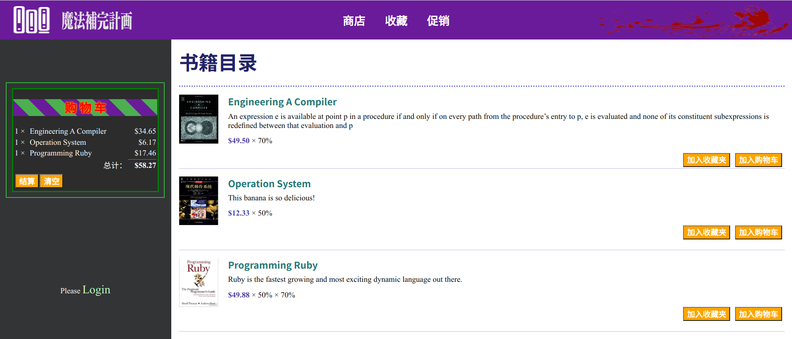

但是比如说需要支付订单的时候，就会自动重定向到登录界面。

## 2 登录

登录界面如图所示

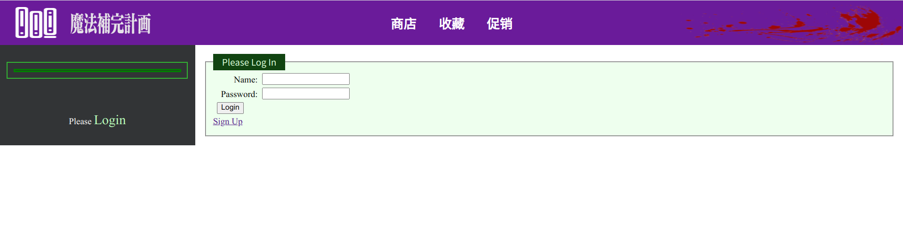

有登录和注册两个选项，对于已经有账号的用户，可以直接登录，正确的密码即可登录，错误的密码会报错，如下所示

正确的密码可以登录，登录后会在左侧面板上显示用户名和登出按键

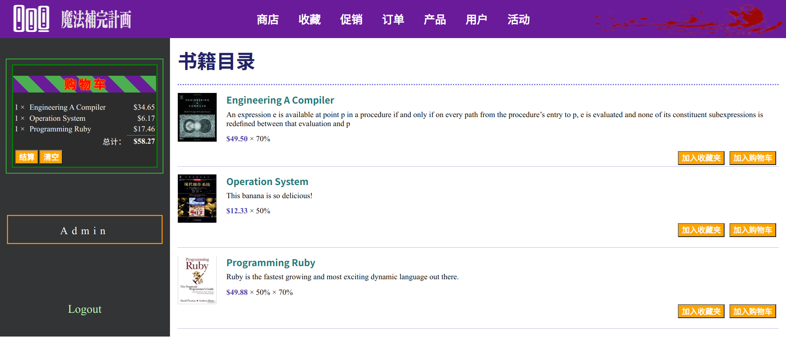

可以看到，随着登录功能，用户的权限增大了（上部导航栏导航增多）

## 3 注册

可以选择注册界面需要输入用户名，密码，并且确认密码，同时需要输入自己的身份。

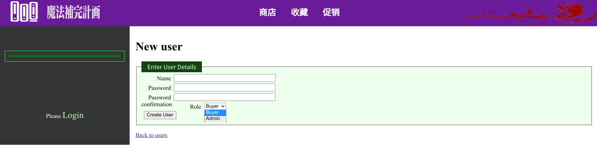

## 4 购物车

用户浏览商品的时候，可以将商品加入购物车，购物车面板会在左侧出现，同时还会显示经过折扣后的价格和购物车的价格总值，用户可以选择清空购物车或者根据购物车中的内容生成订单

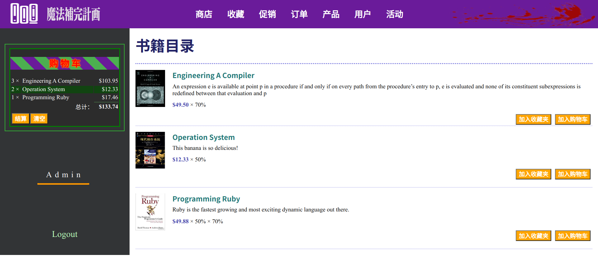

## 5 订单

用户点击“结算”按键，就可以进入订单信息完善界面，通过填写信息生成订单

在管理侧，可以查看订单信息：

订单总览

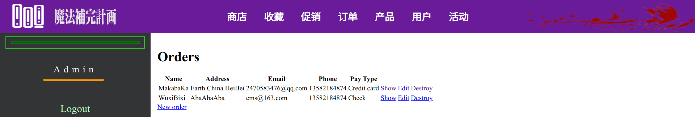

订单详情：

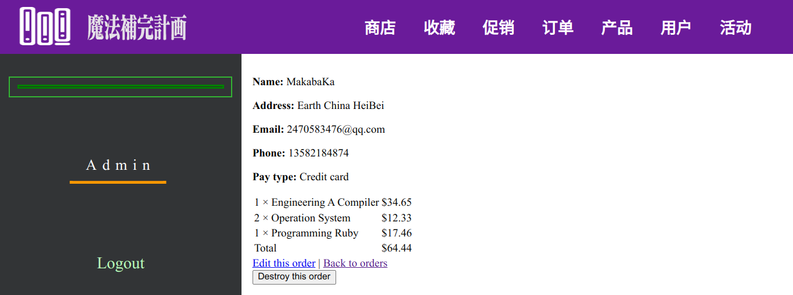

## 6 收藏

用户可以点击商店界面的“加入收藏夹”按钮，即可收藏该商品，在“收藏”这个导航中可以看到用户收藏的所有商品

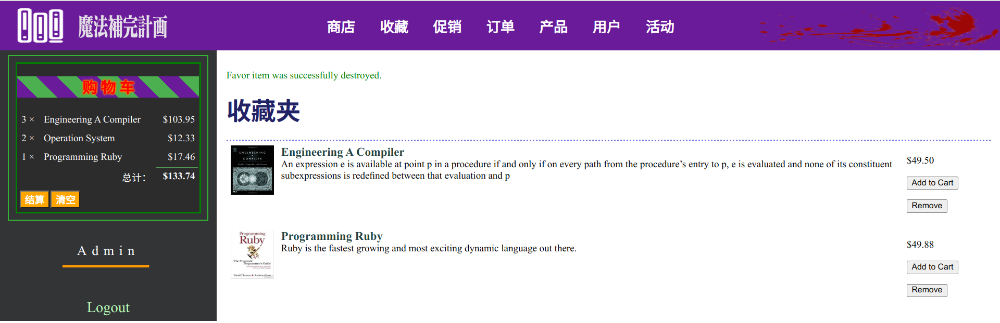

用户可以选择将收藏品加入购物车，同时还可以将收藏品从收藏夹中移除。

## 7 促销

每个促销活动会涉及一些商品，会让商品有一些折扣力度，这些会反应到客户的实际消费中，客户可以在商店界面看到每个商品的折扣力度：

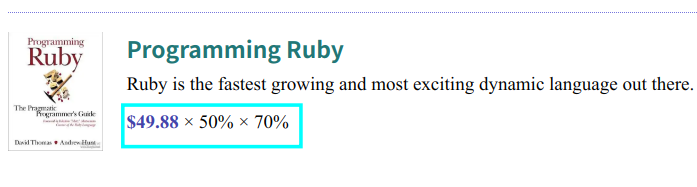

同时用户也可以直接浏览当前的活动，看到涉及的产品和折扣力度

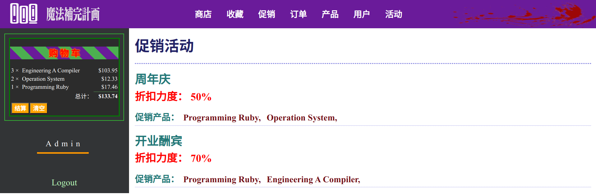

在管理侧，可以创建活动并且选择加入活动的产品

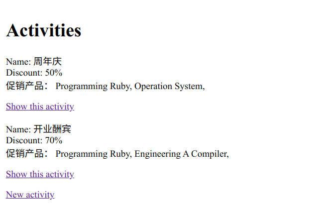

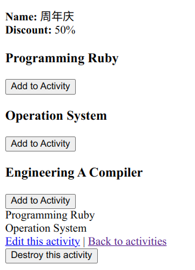

## 8 商品管理

管理员可以对产品进行增删改查操作

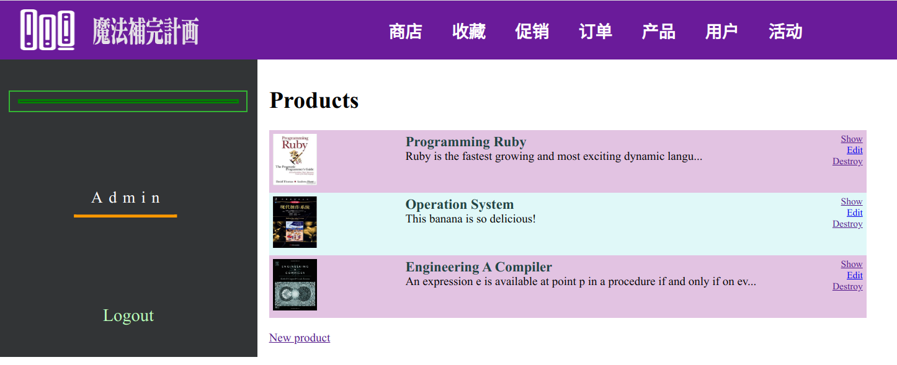

## 9 用户管理

管理员可以对用户进行增删改查操作

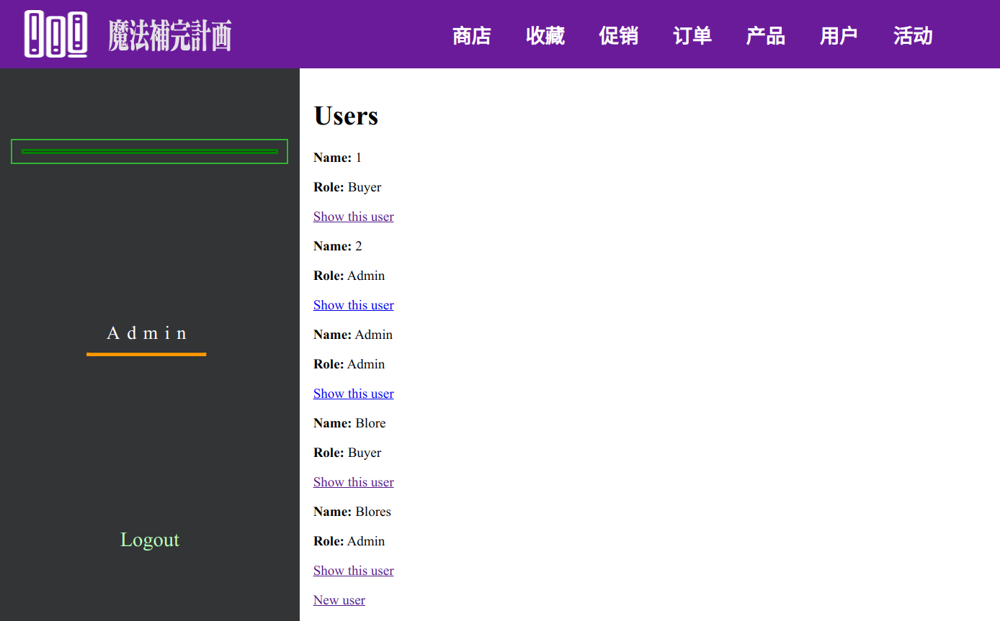

---

