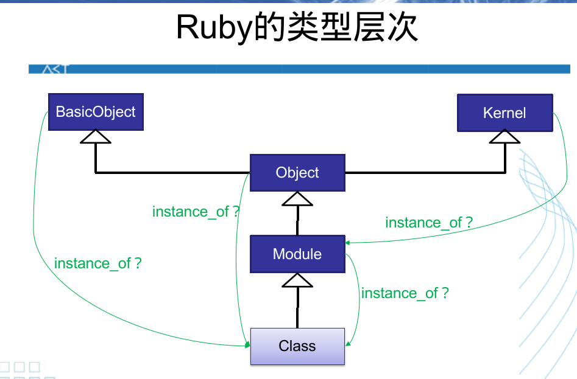

## 一、面向对象基础

### 1.1 定义

```ruby
class Point
    def initialize(x, y)
        @x = x
        @y = y
    end
end

point = Point.new(0, 1)
puts point.is_a? Point        # true
```

​    其中 `initialize` 方法充当了构造器，以 `@` 开头的变量是**实例变量**，也就是说是 Java 中的属性。

​    我们利用 `new` 方法创造一个变量，类似于一个工厂方法。如果往深里探究，应该是 `new` 方法是一个**类对象方法**，也就是说，`Point` 可以作为一个类，同时它也是 `Class` 这个类的一个对象，他作为对象有一个方法是 `new` 。这个 `new` 会调用实例方法（就是 java 中的非静态方法） `new` ，然后完成构造。

​    `is_a?`是一个方法，与 Java 中的 `instanceof` 类似。只要是这个类或者这个类的子类，都会返回 `true` ，与之相似的是 `kind_of?` 。 而如果是 `instance_of?` 那么就只有该类会返回 `true`。

### 1.2 实例方法

#### 1.2.1 to_s

​    转换成字符串的方法，如下

```ruby
def to_s
    "(#{@x}, #{@y})"
end
```

#### 1.2.2 getter, setter

​    我们可以用常规的方法定义，没错，感觉 ruby 的方法名中可以出现各种特殊字符

```ruby
# getter
def x
    @x
end

def y
    @y
end

# setter
def x=(value)
    @x = value
end

def y=(value)
    @y = value
end
```

​    这种方法无疑是最好的，因为可以掩盖内部具体的实现细节，不过如果只是普通的 `getter, setter` 那么其实可以利用元编程的知识，直接用 `Module` 的方法。

```ruby
attr_accessor :x, :y
```

​    所谓的“元编程”就是利用代码创造代码，这里就不详细说了。`attr_accessor`  是一个 `Module` 的方法，`Class` 是 `Module` 的子类，可能 `Point` 也是 `Module` 的子类，所以可以使用这个方法。

#### 1.2.3 operator

​    和 C++ 一样，Ruby 是可以定义运算符的，而且似乎更加简洁，跟定义方法一模一样，这可能是由于 Ruby 的方法声明中允许特殊字符的存在，而且单参数调用时可以不加括号导致的。我们为 `Point` 定义三个方法

​    定义加法：

```ruby
def +(other)
    Point.new(@x + other.x, @y + other.y)
end
```

​    定义负号，这里需要注意，有一个 `-@` 的特殊写法

```ruby
# negative
def -@
    Point.new(-@x, -@y);
end
```

​    定义数乘，这里和 C++ 一样，是没有办法写 `3 * point` 的，只能写 `point * 3`

```ruby
def *(scalar)
    Point.new(@x * scalar, @y * scalar)
end
```

​    为了解决这个问题，我们可以定义个 `coerce` 方法，似乎这个方法会在 `3.*` 的时候使用，然后返回的值会重新调用 `point.*` 但是具体的原理就不清楚了。

```ruby
def coerce(other)
    [self, other]
end
```

​    定义索引访问：

```ruby
def [](index)
    case index
    when 0, -2 then @x
    when 1, -1 then @y
    when :x, "x" then @x
    when :y, "y" then @y
    else nil
    end
end
```

​    这个是一个只读数组，如果想写这个东西，需要其他的东西。

#### 1.2.4 iterator

​    我们可以定义迭代器方法 `each`

```ruby
class Point
    ...
    def each
        yield @x
        yield @y
    end

    include Enumerable
end
```

​    底下这个 `include` 很有意思，学名叫做**混入**。似乎 `Enumerable` 这个模块里有很多基于 `each` 的方法，所以只要混入这个模块，就可以拥有这一堆的迭代器方法（似乎叫做枚举器方法更为合适）

```ruby
pointA.each {|e| puts e}
puts pointA.all? {|e| e == 0}
puts Point.new(0, 0).all? {|e| e == 0}
```

#### 1.2.5 equal

​    在 `Ruby` 中一般与 `Java` 相反，我们用 `==` 表示内容上的相等，而用 `eq?` 表示同一个引用。所以我们一般需要重写 `==` 号

```ruby
def ==(other)
    if other.is_a? Point
        @x == x && @y == y
    else
        false
    end
end
```

​    但是同时我们又在 `Hash` 结构中，使用的是 `eq?` 这个方法（所以前面那个约定好没用），和 `Java` 一样，如果 `eq?` 判断相等了，`hash` 就必须判断相等。所以只要定义了 `eq?` ，那么就需要定义 `hash` ，并且满足前面的条件。

#### 1.2.6 Comparable

​    只要定义了 `<=>` 就可以获得一大堆比较符。

```ruby
include Comparable
def <=>(other)
    @x**2 + @y**2 <=> other.x**2 + other.y**2
end
```

 `Comparable` 也是一个混入模块。

### 1.3 类方法

​    对应的是 Java 中的静态方法，但是实际上很不一样。类方法在 ruby 中是**类对象的单键方法**，也就是说，**类本身就是一个对象**。定义单键方法，需要指定方法所属的对象。如图所示

```ruby
class Point
    ...
    def self.sum(*points)       # self means the "Point", not the point
        x = y = 0
        points.each {|p| x += p.x; y += p.y}
        Point.new(x, y)
    end
end

# single-key
puts "sum = #{Point.sum(pointA, pointB, pointC)}"
```

### 1.4 类常量

​    定义在类中的常量，这个对应 Java 中的静态常量，如下所示

```ruby
class Point
    ...
    def initialize(x, y)
    end
    ...
    ORIGIN = Point.new(0, 0)
end

puts "Origin = #{Point::ORIGIN}"
Point::UNIT_X = Point.new(1, 0)
puts "Unit x = #{Point::UNIT_X}"
```

​    有一个很有意思的，就是 `ORIGIN` 要在 `initialize` 之后，就很神奇，大概还有声明先后的问题吧。

### 1.5 类变量

​    定义在类中的变量，静态变量，如下所示

```ruby
class Point
    @@n = 0
    @@totalX = 0
    @@totalY = 0
    ...
    def initialize(x, y)
        @x = x
        @y = y

        @@n += 1
        @@totalX += x 
        @@totalY += y 
    end

    def self.report
        puts "There are #{@@n} points"
        puts "total x is #{@@totalX}"
        puts "total y is #{@@totalY}"
    end
end

Point.report
```

### 1.6 方法的可见性

​    默认方法一般都是 `public` ，除了 `initialize` 。当然对于全局的方法（就是函数），他是 `Object` 的实例私有方法。

​    同样是三种：

- `private`：没法用 `object.method` 或者 `self.method`  调用，只能直接 `method` 使用。这只是定义，如果要解释的话，那么就是适用于 `method` 这种写法的东西，就是其他实例方法。
  
- `protected`：只能在
  
---

## 二、面向对象高阶

### 3.1 Struct

​    利用 `Struct` 类可以快速创造出一个类，我的评价是充满了神秘，比如说之前实现的 `Point`

```ruby
OtherPoint = Struct.new(:x, :y)
class OtherPoint
    def +(other)
        Point.new(self.x + other.x, self.y + other.y)
    end

    def to_s
        "(#{self.x}, #{self.y})"
    end
end
```

​    感觉 Ruby 十分灵活，可以随时改变类，而且可以多次改变类，如下所示

```ruby
OtherPoint = Struct.new(:x, :y)
class OtherPoint
    def +(other)
        Point.new(self.x + other.x, self.y + other.y)
    end

    def to_s
        "(#{self.x}, #{self.y})"
    end
end

otherPointA = OtherPoint.new(4, 3)
puts otherPointA
otherPointA.x = 1

class OtherPoint
    undef x=, y=
end

# otherPointA.x = 2 NoMethodError
```

### 3.2 打开

​    这个就很本质了，就是对于这样的语句

```ruby
class SomeClass
    ...
end

module SomeModule
    ...
end
```

​    除了第一次有**定义**的意思，只有都是有“给原有的东西添砖加瓦的意思”。每次的“打开”，都意味着一种 `self` 指针的变换和作用域的变化。

### 3.3 泛化关系

​    基本上所有的类都是 `Object` 类的子类，`Class` 是 `Module` 类的子类，所有的类都是 `Class` 类的实例化，所有的模块都是 `Module` 的实例化 。`Kernel` 是一个 `Module`，它混入了 `Object` ，所以哪里都有他，他似乎提供了基本的方法实现（类似于某种 `stdlib`）。

​    跟前面的 `Struct` 类似，也可以有很多神秘的语法

```ruby
M = Module.new        # some module called M
C = Class.new        # some class called C
D = Class.new(C){include M} # some C subclass called D, which include M
```

### 3.4 include, extend

利用 `include` 和 `extend` 都可以进行 Mixin（混入操作），对于 `include` 就是直接混入到实例上？ `extend` 是混入到类上？

### 3.5 关系



---

## 三、函数式特征

### 3.1 block

`block` 是 一小段代码，用 `{}` 包裹， 用 `yield` 关键字调用。迭代器就是基于这个实现的。

```ruby
def call_twice
    yield
    yield
end
call_twice {puts "Hello World"}
```

​    `yield` 是可以传参的

```ruby
def call_twice
    yield(1)
    yield(2)
end
call_twice { |x| puts "Hello World! #{x}"}
```

### 3.2 Proc

### 3.3 Lambda

