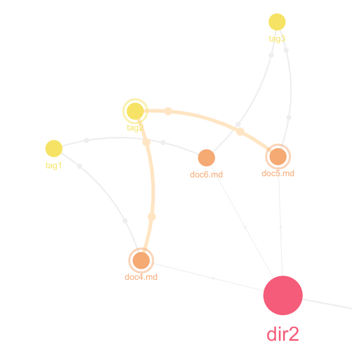

# ficus 功能

## 榕树模式

### 榕树的生成

榕树模式是文档内的一种编辑模式，在这种模式下，文档会被展示成一棵结构化的榕树。

树的非叶子节点包括：

- 各级标题
- 列表虚拟节点（这是因为在 markdown 中没有像 latex 一样的 ``itemize`` 一样的总体结构）

树的叶子节点包括：

- 文本段
- 数学块
- 代码块
- 引用
- 列表
- 表格

需要注意的是，以下 md 实体并不是叶子节点：

- 加粗
- 斜体
- 下划线
- 链接
- 图片

对于如下 md 源码

```markdown
# 一级标题 1

## 二级标题 1

`int main(){return 0;}`

$$
1 = 1 + 1
$$

### 三级标题 1

一段文字

> 一段引用

## 二级标题 2
- item1
- item2
- item3
# 一级标题 2
```
生成如下 Ficus 树：


需要注意这是一颗有序树，也就是兄弟节点之间是有顺序的。

### 榕树的展示

榕树模式大大增强了文档的架构展示，让原本线性的文本变成了更加有逻辑的树形结构。

为了方便用户更加直观和全面的了解文章的架构，我们增设了许多功能来帮助用户。

**节点折叠展开**：

当节点折叠时，它的孩子节点会被隐藏；当节点展开时，它的孩子节点会被显示。

我们有两种方式进行节点的折叠和展开：

第一种是直接在图上点击节点右侧的 ‘+’ 或者 ‘-’ 进行展开或者折叠


第二种是在左侧的工具栏处对于整体榕树进行统一的折叠和展开操作：


**榕树样式选择**：

我们为榕树的展现形式提供了多种样式，您可以在工具栏中从 5 种样式中进行选择：


### 榕树的编辑

这棵树不仅有展示功能，您还可以通过拖拽对其进行编辑操作，所有的操作都会被同步到文档中：

- 平级交换：通过拖动节点，您可以互为兄弟的节点交换顺序
  
- 层次改变：您可以将标题类节点拖动到其他标题类节点上，此时这个节点会转变成目标节点的孩子，相应的
  
- 内容修改：您可以点击节点，并修改他们的内容
  

此外，用户还可以通过右键菜单进行更加准确的操作，右键菜单如图所示：


## 榕林模式

### 榕林的初衷

受制于一些客观条件，我们可能会写很多个细碎的文档，或者写一个很冗长的文档，这些“畸形”的文档如果一个个的整理，并不是一件容易的事情。

榕树提供将多个文档展现在一个“工作平台”，这样就可以同时对多个文档进行编辑操作。我们对于每一个文档都以“榕树”的形式展示，多棵榕树组成了“榕林”。

当我们在榕林上完成操作后，确定没有问题后，可以将榕林的结果导出到指定文件夹，目前是 `.\out` 文件夹。

### 榕林的选择

如何选择进入榕林的榕树们呢？我们提供了两种模式：

- 榕根选择：用户可以根据榕根（后文会有介绍）逻辑对进入榕林的文件进行选择
- 榕柱选择：用户可以根据榕柱逻辑对于进入榕林的文件进行选择

用户可以在侧边栏处选择对应的模式和具体进入的文件，如下图所示：


### 榕林的操作

榕林内的操作基本上和榕树相似，只有以下几点不同：

- 榕林不允许直接添加与 Forest 相连的子节点，这些子节点代表文件本身。被称为“基底”。
- 增加基底需要通过侧边栏按键。
- 如果不满意当前的榕树们，可以用“清除”按钮将榕林清空。

当编辑完成后，即可点击侧边栏的“导出”按钮进行导出。在榕林上进行的编辑操作，并不会修改原本的文档。

### 榕林的局限性

按照最开始的设计，榕林并不应该是直接导出的形式，但是考虑到如同图片、引用这类的非文本本地资源，如果直接在文档本身进行操作，会导致“资源引用”发生错误。后来才采取了“导出”的形式，希望将资源和文档一起导出，避免了资源的引用错误。

但是实际上我们的导出功能也没有办法追踪资源位置，导致采用相对路径的资源依然会出现错误。但是“导出”的形式为后续的开发提供了一种实现的可能性。

## 榕图模式

您可以通过榕图查看和编辑文档间联系，文档间联系有三种类型：

- 榕根 (ficus root)：表示文档在文件系统中的组织关系
- 榕柱 (ficus prop)：文档与标签（tag）间的联系
- 榕须 (ficus aerial)：文档间的引用关系和被引用关系

当您打开一个文件夹，并且在侧边栏中选择榕图侧边栏，即可以进入以当前文件夹为榕图中心点的榕图。您可以通过点击图中的节点进行聚焦，榕图上会高亮聚焦节点和与之相关的节点。

在榕图侧边栏的会显示当前节点的信息和他的邻居组，您可以通过可视按钮控制榕图上节点的显示控制文档节点的显示。并且选择一些对应的关系转换操作。

### 榕根

#### 榕根的定义

榕根的本质是文件系统的关系，如果一个子文件或者子文件夹属于一个父文件夹，那么在父子之间就会存在一条榕根。

榕根是一种 [MECE](/pages/b190d0/) 的体现，榕根是完全的树形结构，符合“不遗不漏”的原则。榕根的建立其实是归档的过程，将笔记按照唯一的原则进行归档，方便笔记体系的结构化。

#### 榕根的展示

对于如下目录结构：

```shell
fgraph-demo
├── dir1
│   ├── doc2.md
│   └── doc3.md
├── dir2
│   ├── doc4.md
│   ├── doc5.md
│   └── doc6.md
└── doc1.md
```

应形成如下结构


其中图上的“箭头静态实线”表示榕根。`fgraph-demo`的榕根已经被加粗紫色高亮。

#### 榕根转榕柱

对于文件夹节点，我们可以对其执行“转变为tag”操作，则当前节点的榕根都会转变为榕柱，我们对于 `dir1` 节点执行这个操作，效果如图：

**转变前：**


**转变后：**


这种操作可以改变笔记的归档结构，结合“榕柱转榕根”的操作，可以方便地进行归档文档的整理和变更工作。

### 榕柱

#### 榕柱的定义

由单层 tag 组织起来的 Ficus 关系，一个 md 文档可以具有多个 tag。一个 tag 对应一个节点，所有具有该 tag 的文档与这个 tag 节点间都有一条边。可以被看做一种以 tag 为中心的星形图。

榕柱是一套标签系统，这套系统相对于榕柱，体系感会减弱，但是会更加适合知识的检索。

可以在侧边栏中用标签管理器创建 tag，而且创建好的 tag 会显示在文档头部。当然也可以直接在文档头部添加 tag，语法如图所示

```markdown
// doc4.md
---
tags:
  - tag3
  - tag1
---
```

#### 榕柱的展示

在上文中的目录结构，tag 情况如下：

- doc4.md: `tag1`, `tag2`
- doc5.md: `tag2` , `tag3`
- doc6.md: `tag1`, `tag3`

此时的 Ficus 柱如图所示：


其中图上的“圆点动态实线”为榕柱，`tag2`的榕柱已经被黄色加粗。

#### 榕柱转榕根

对于当前 tag 节点，我们可以对其执行“转变为文件夹”，效果如图：

**转变前：**



**转变后：**


可以转变的的榕根的节点需要在同一路径下，我们将在不同路径下的节点分在了不同的组中。

榕根体系相对于榕柱体系要更加的灵活自由，但是同样的缺少了逻辑性和体系化。利用这个功能可以将原来成熟的榕须转变成榕根，是笔记变得更加体系化。

### 榕须

#### 榕须的定义

由拓展 md 语法 `-[ref_name](file_path)` 构建出的关系。这种关系是一种有向的关系，关系的两个端点分别是引用文档和被引用文档。

榕须所代表的引用关系，则不再具有榕根和榕柱明显的层次关系，变成了“文档与文档间”的一种关系，这种关系描述的是“知识与知识”的平级联系，而非“知识与知识标签”、“知识与知识类别”这种不平等的联系。这也是一种较为自然的联系方式，就如同我们在写论文的时候使用的“参考文献”。

用户同样可以在侧边栏中查看文档的引用和被引用关系。

#### 榕须的展示

对于上文的示例，存在引用关系：

- `doc2.md` 引用 `doc3.md`
- `doc3.md` 引用 `doc2.md`

那么对应的 Ficus 须的结构如下所示：


其中图上的“动态虚线”为榕须，`doc3 -> doc2`的榕须已经被橙色加粗。

#### 榕须转榕柱

对于当前文档节点，我们可对其执行“转变为tag”的操作，与当前文档通过榕须相关（我们提供了三种相关模式）的所有文档会被统一加上一个 tag。

**转变前：**


**转变后：**


榕须会让多个文档以“面对面”的方式组织起来，但是这样并不容易提取这个“文档群”的关键特征，“须转柱”的操作使得用户可以提取这些彼此引用的文档群的共同特征，并用一个 tag 进行标识。