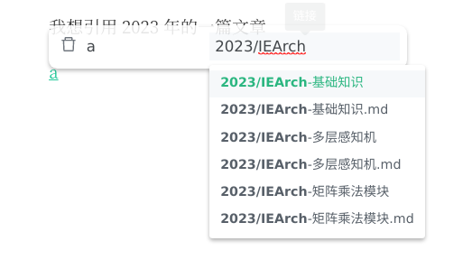

# 使用技巧

## 数学公式补全

我们内置了数学公式补全器，在输入 latex 公式的时候会自动补全，如下所示：

## 引用路径补全

在输入诸如图片、榕引用等本地资源地址时，我们提供了查找功能。

## 编辑悬浮框

为了方便用户的编辑，我们提供了多种编辑悬浮框来辅助用户的 markdown 编辑。

## 榕图节点搜索

如果榕图上的点过多，肉眼难以查找，可以使用搜索功能进行查找：

## 忽略文件和文件夹

我们在偏好设置中提供了输入框，用户可以输入自己不想在资源管理和榕图等地方显示的文件。

## 数学公式渲染器

对于不同的数学公式渲染器，可以渲染的范围是不同的，Ficus 用户可以自己挑选适合的渲染器。

## 面包屑

Ficus 的面包屑不仅支持显示当前路径的功能，还支持文档跳转功能