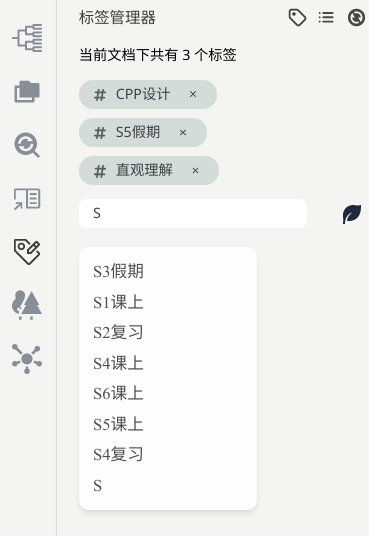
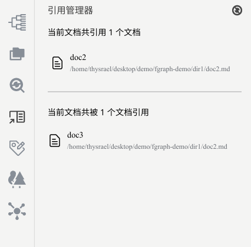
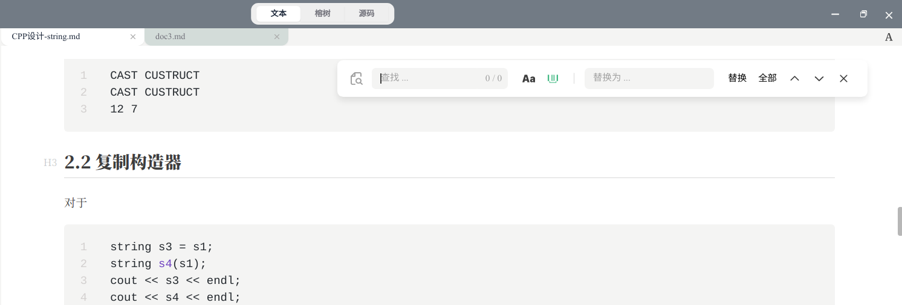
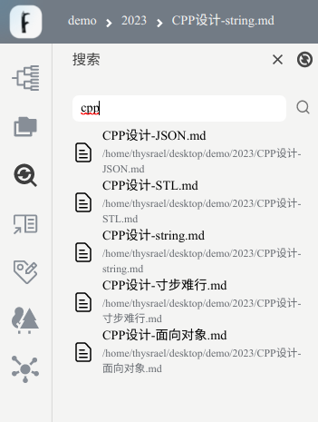
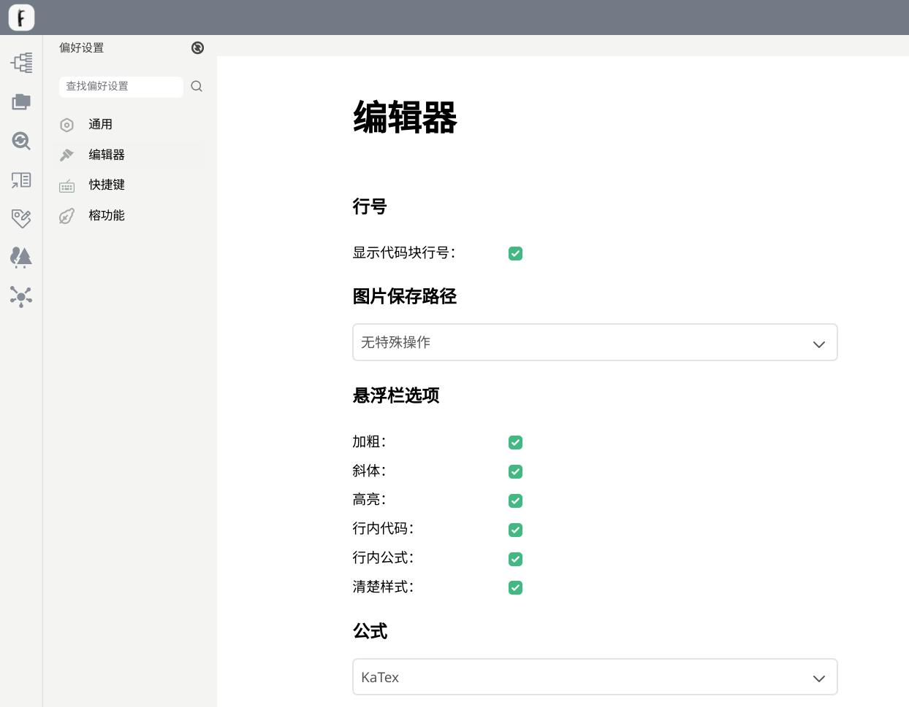

# 其他功能

## 打开

Ficus 支持两种打开模式

- 打开文件：此时只编辑文件，只能使用编辑模式转换、大纲和部分引用和标签功能
- 打开文件夹：此时编辑对象为整个工作目录，可以使用“打开文件”的所有功能，并且具有资源管理、榕林、榕图、引用、全局搜索和标签的全部功能

## 标签管理

Ficus 支持标签系统，用户可以在 front fomatter 中自行设置，如下所示：

```markdown
---
tags:
  - tag1
  - tag2
---
```
此时文档具有 `tag1` 和 `tag2` 两个标签。

Ficus 还提供了标签管理的侧边栏用于更加便捷高效的管理标签，可以分为两个模式，在左上角进行切换：


第一个模式为“当前文件标签”，在这个页面中展示当前文档的所有标签，并可以在此处添加新的标签。如下所示



第二个模式为“所有标签”，在这个页面展示当前打开文件夹里的所有标签，并且可以根据标签检索文档，如下所示：


## 引用管理

Ficus 支持自定义的文档间引用，语法如下：

```markdown
-[ref_name](file_path)
```
Ficus 提供了引用管理器来管理引用，侧边栏中会显示当前文件引用的文件和引用当前文件的文件，实现了双向检索，如图所示：



## 搜索替换

Ficus 支持两个维度的搜索替换功能：

**文档内搜索替换：**



支持文档内的搜索和替换功能。

**全域搜索：**



支持全域搜索。

## 导出

Ficus 支持多种导出功能：
- 文档：支持导出 PDF 和 HTML 格式
- 榕树、榕林、榕图：支持导出 PNG 和 SVG

## 偏好设置

我们在侧边栏的左下角有偏好设置，用户可以依靠自己的喜好进行设置。包括通用、编辑器、快捷键和榕功能。需要离开偏好设置页面并重启才有效果。

