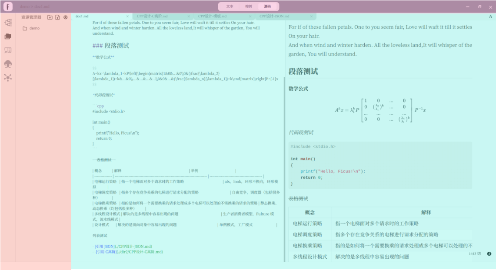

# 功能分区

## 分区

可以被分成 3 个部分，即顶栏（红色），侧边栏（橙色），主区域（青色）。

## 顶栏 Header

- 点击左上角 logo 即可查看**菜单**。
- 面包屑在“打开文件夹”模式下可以查看相对于工作区目录的路径，并且进行跳转
- 模式转换器可以切换文档的不同显示模式，一共有三种模式：
  - **文本模式**：所见即所得的渲染模式
  - **榕树模式**：将文档组织成知识图谱的形式，既可以修改文章的内容，还可以修改文章的结构
  - **源码模式**：双栏模式，左侧展示 markdown 源码，右侧展示渲染好的界面

## 侧边栏 SideBar

- 文档大纲：可以查看当前文档的各级标题并进行标题跳转
- 资源管理器：可以查看工作区目录的文档结构、打开需要编辑的文档、并进行基础的文件系统操作
- 搜索：对于打开文件夹中的所有 md 文件内容进行搜索。
- 引用管理器：可以查看引用和被引用关系，并完成文档的打开
- 标签管理器：可以为文档设置标签、新建标签、查询标签对应的文章
- 榕林：对多个文档进行联合编辑，并将结果导出到目标文件夹
- 榕图：可以查看文档间联系，对联系进行编辑

## 主区域

- tab 栏：可以存储需要编辑的 markdown 文档，关闭编辑完成的文档
- 主区域：文本、榕树、榕林、榕图均显示在此处